---
## Author
author:
  name: Гурылев Артем Андреевич
  email: 1132236135@pfur.ru
  affiliation:
    - name: Российский университет дружбы народов
## Title
title: Лабораторная работа №2
subtitle: Настройка DNS-сервера
license: CC BY
date: today
date-format: "YYYY-MM-DD"
---

# Информация

## Докладчик

  * Гурылев Артем Андреевич
  * Студент
  * Российский университет дружбы народов им. П. Лумумбы

## Цель работы

- Целью данной лабораторной работы является приобретение практических навыков по установке и конфигурированию DNS сервера, а также усвоение принципов работы системы доменных имён.

# Выполнение лабораторной работы

## Установка необходимого ПО

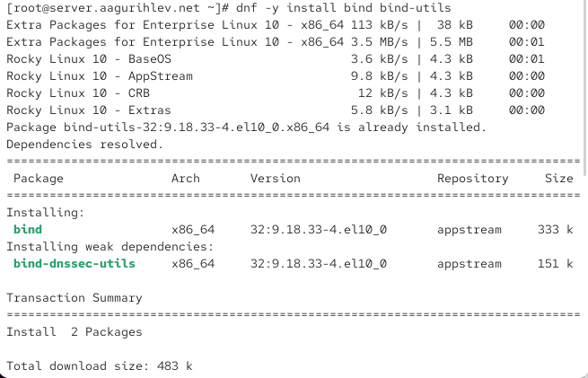{height=80%}

## Проверка команды dig

{height=80%}

## Файл resolv.conf

{height=80%}

## Файл named.conf

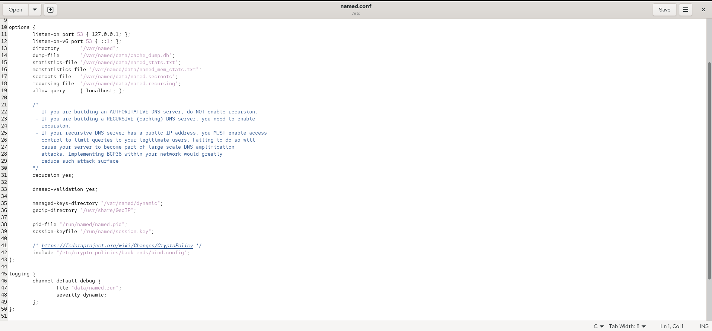{height=80%}

## Продолжение файла named.conf

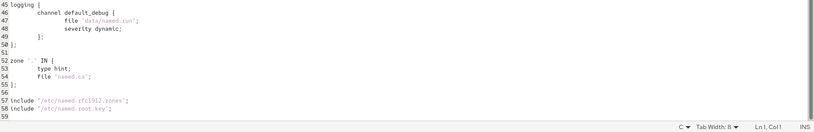{height=80%}

## Файл named.ca

{height=80%}

## Включение DNS-сервера

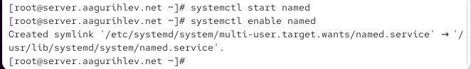{height=80%}

## Выполнение команды dig

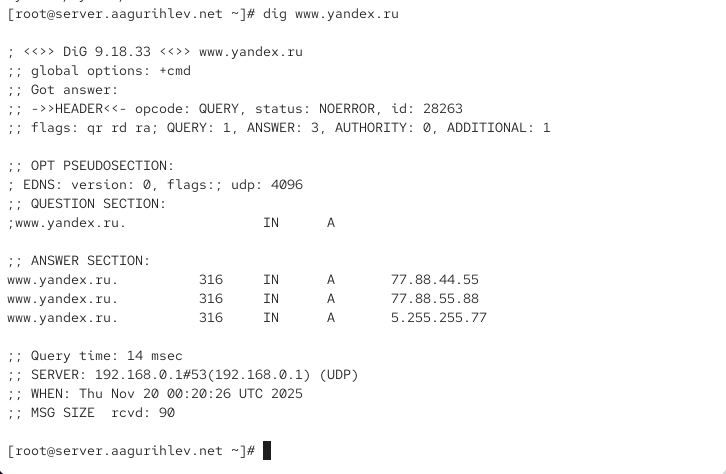{height=80%}

## Выполнение команды dig с изменениями

{height=80%}

## Изменение настроек сетевого соединения

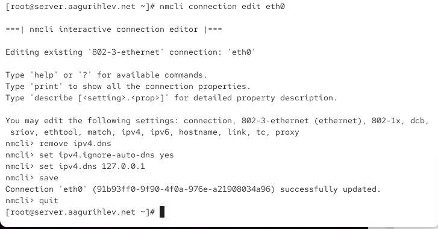{height=80%}

## Файл resolv.conf после перезапуска NetworkManager

{height=80%}

## Изменение файла named.conf

{height=80%}

## Информация о запросах по UDP

{height=80%}

## Копирование шаблона зоны

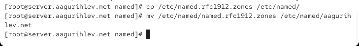{height=80%}

## Включение файла описания зоны в конфигурационном файле

{height=80%}

## Создание нужных подкаталогов

{height=80%}

## Редактирование файла описания зон

{height=80%}

## Копирование шаблона прямой DNS зоны

{height=80%}

## Изменение файла прямой DNS зоны

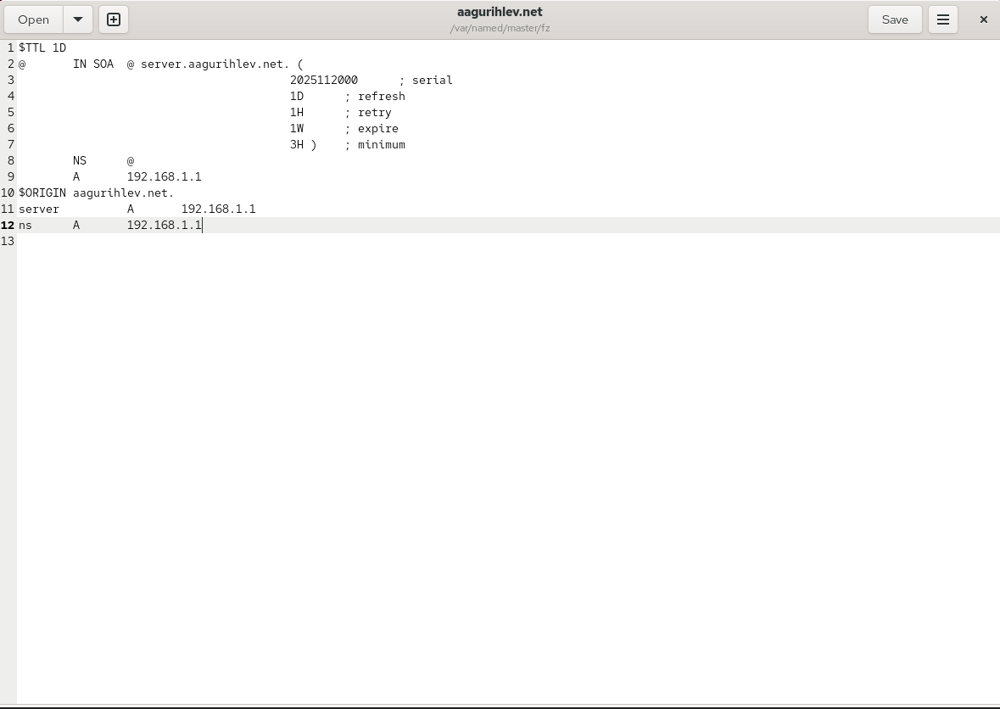{height=80%}

## Копирование шаблона обратной DNS зоны

{height=80%}

## Изменение файла обратной DNS зоны

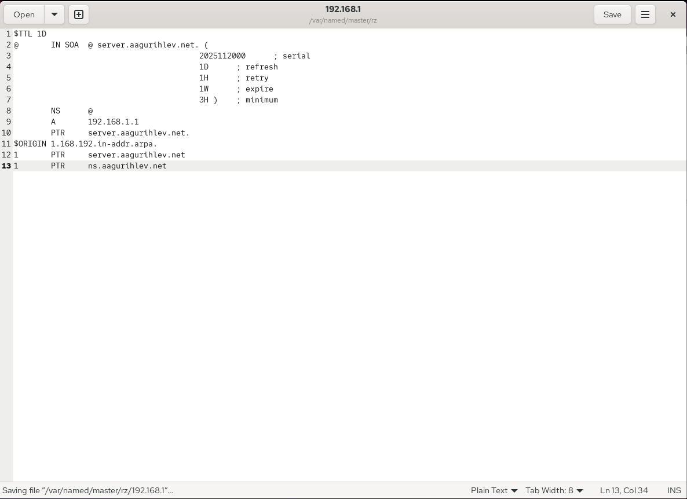{height=80%}

## Исправление прав доступа файлов

{height=80%}

## Восстановление меток безопасности SELinux

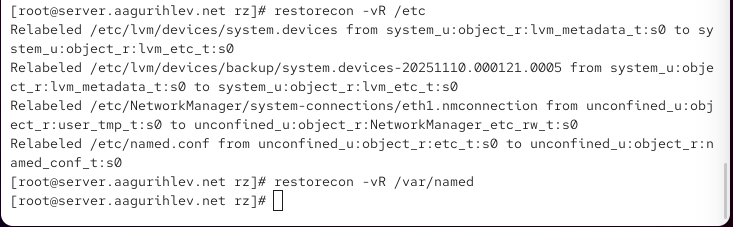{height=80%}

## Проверка состояния переключателей SELinux

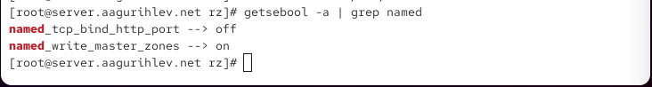{height=80%}

## Журнал системных сообщений

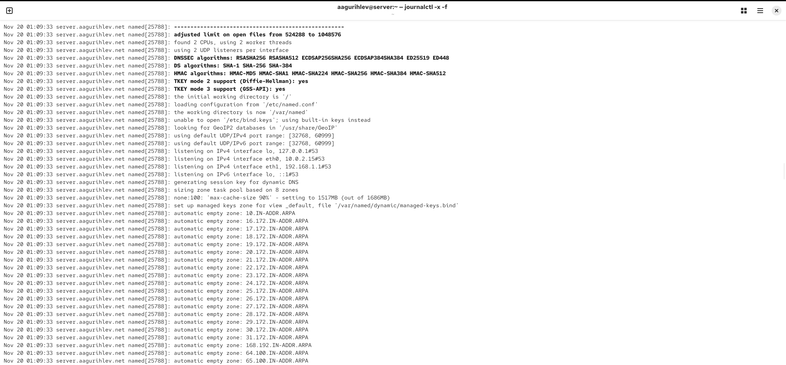{height=80%}

## Продолжение журнала системных сообщений

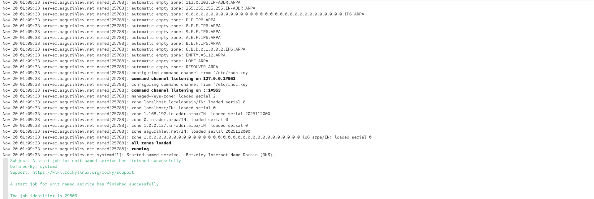{height=80%}

## Описание DNS зоны сервера командой dig

{height=80%}

## Анализ корректности работы DNS сервера

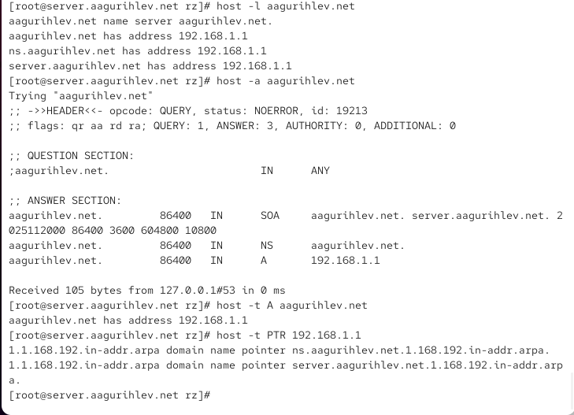{height=80%}

## Provision скрипт dns.sh

{height=80%}

## Добавление provision скрипта в Vagrantfile

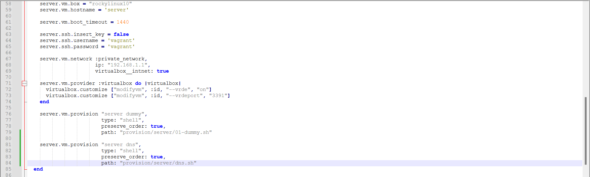{height=80%}

## Выводы

В этой лабораторной работе я установил и сконфигурировал DNS сервер, а также научился принципам работы системы доменных имён.

