---
## Author
author:
  name: Гурылев Артем Андреевич
  email: 1132236135@pfur.ru
  affiliation:
    - name: Российский университет дружбы народов

## Title
title: "Лабораторная работа №2"
subtitle: "Настройка DNS-сервера"
license: "CC BY"
---

# Цель работы

Целью этой лабораторной работы является приобретение практических навыков по установке и конфигурированию DNS сервера, а также усвоение принципов работы системы доменных имён.

# Выполнение лабораторной работы

Для работы DNS сервера установим необходимые утилиты.([рис. @fig-001])

{#fig-001}

Проверим работу команды dig. Она выводит информацию о доменных именах запрошенного адреса, о DNS зонах и их IP адресах, и время ответа на запрос.([рис. @fig-002])

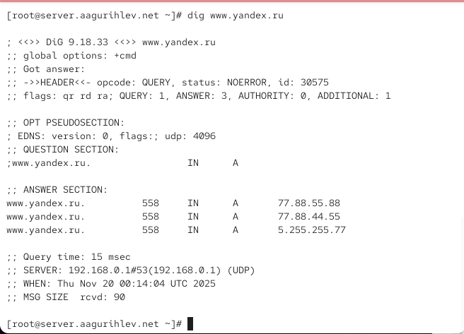{#fig-002}

Посмотрим файл resolv.conf. В нём содержится информация о DNS серверах, и в этом файле доменное имя пользователя получает определённый IP адрес.([рис. @fig-003])

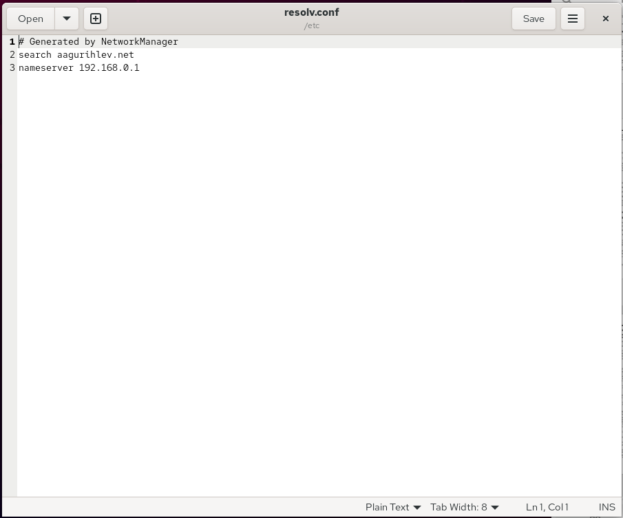{#fig-003}

Посмотрим файл resolv.conf. Это конфигурационный файл DNS сервера - в нём содержатся различные опции(например, рекурсия) и пути к нужным файлам, таким как статистика, ключи безопасности и файлы логов сообщений.([рис. @fig-004])

{#fig-004}

В самом низу файла named.conf находятся строки, которые подключают ключ и файлы зоны к серверу.([рис. @fig-005])

{#fig-005}

Файл named.ca содержит информацию о важных root серверах Интернета. Она необходима для кэширования доменных имён в Интернете.([рис. @fig-006])

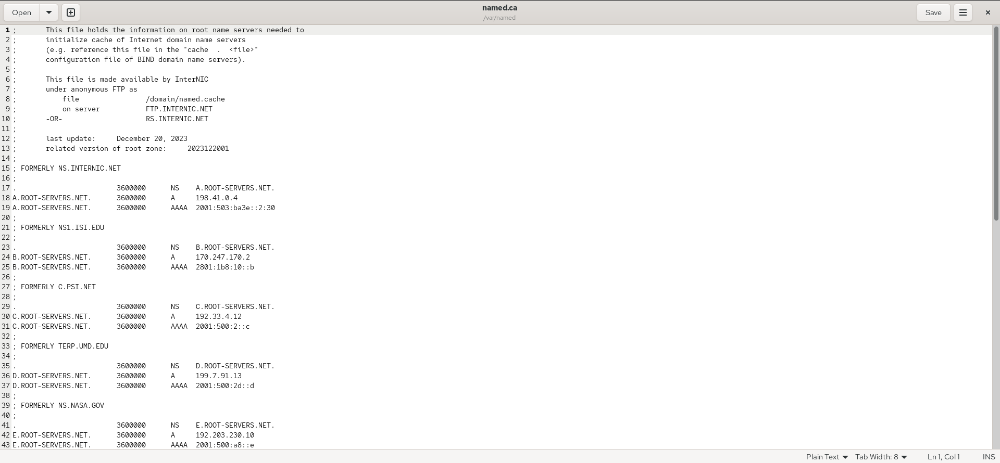{#fig-006}

Включим DNS сервер, с которым будем работать в дальнейшем.([рис. @fig-007])

{#fig-007}

Выполним команду dig, как в начале работы.([рис. @fig-008])

{#fig-008}

Теперь выполним её, добавив IP адрес локального хоста. Так как подключение к нему не прошло, dig показал только информацию о доменных именах yandex.ru. Если бы все прошло успешно, вывелась бы и информация о localhost.([рис. @fig-009])

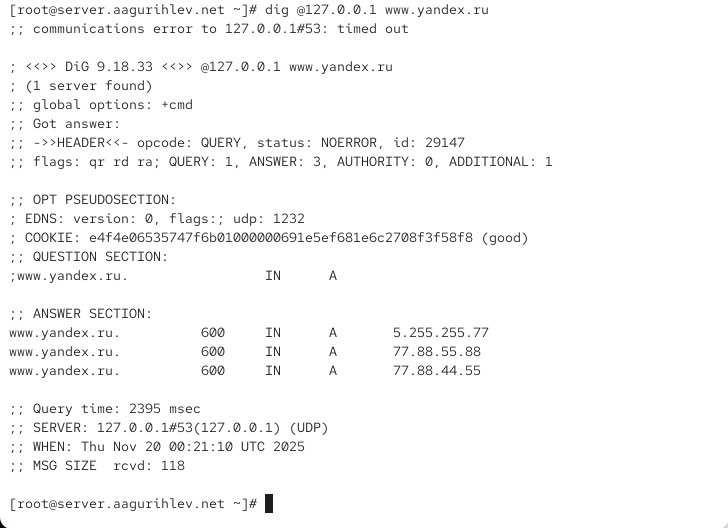{#fig-009}

Сделаем DNS-сервер сервером по умолчанию для хоста и внутренней виртуальной сети.([рис. @fig-010])

{#fig-010}

После перезапуска службы файл изменился.([рис. @fig-011])

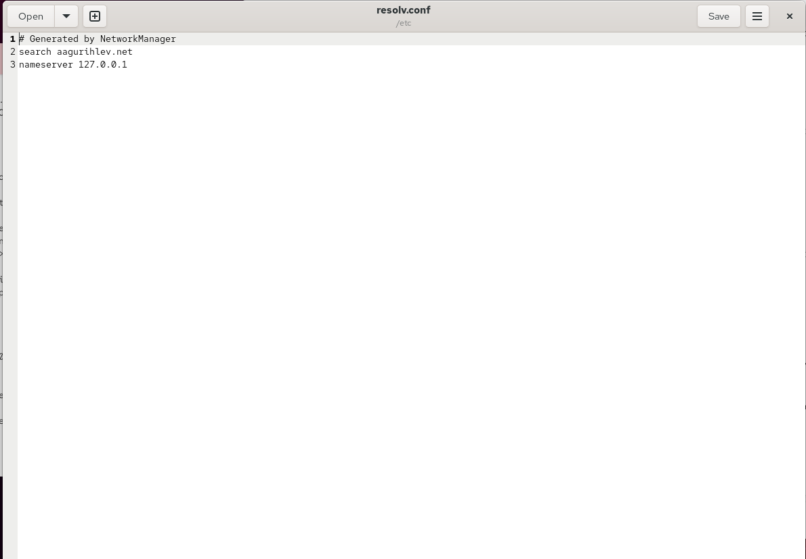{#fig-011}

Отредактируем файл named.conf.([рис. @fig-012])

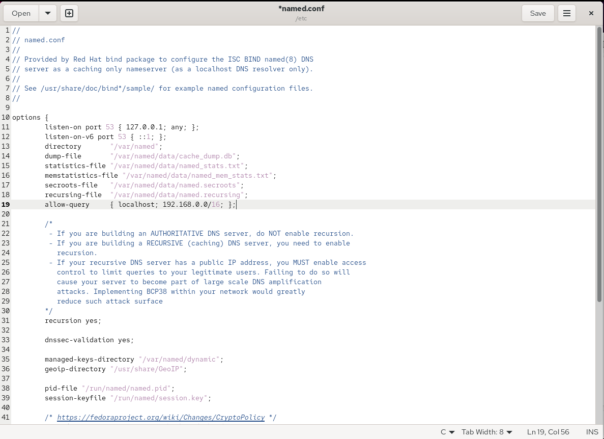{#fig-012}

Посмотрим информацию о запросах по UDP - сервер присутствует.([рис. @fig-013])

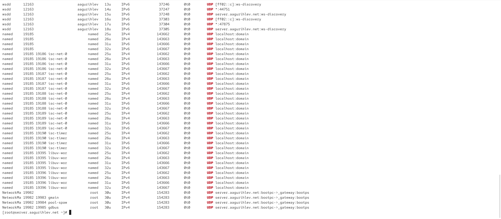{#fig-013}

Скопируем шаблон файла зоны.([рис. @fig-014])

{#fig-014}

Включим файл зоны в конфигурационном файле DNS-сервера.([рис. @fig-015])

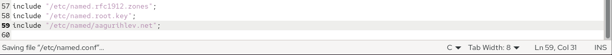{#fig-015}

Создадим нужные подкаталоги для прямой и обратной зоны.([рис. @fig-016])

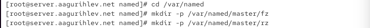{#fig-016}

Отредактируем файл описания зон согласно лабораторной работе.([рис. @fig-017])

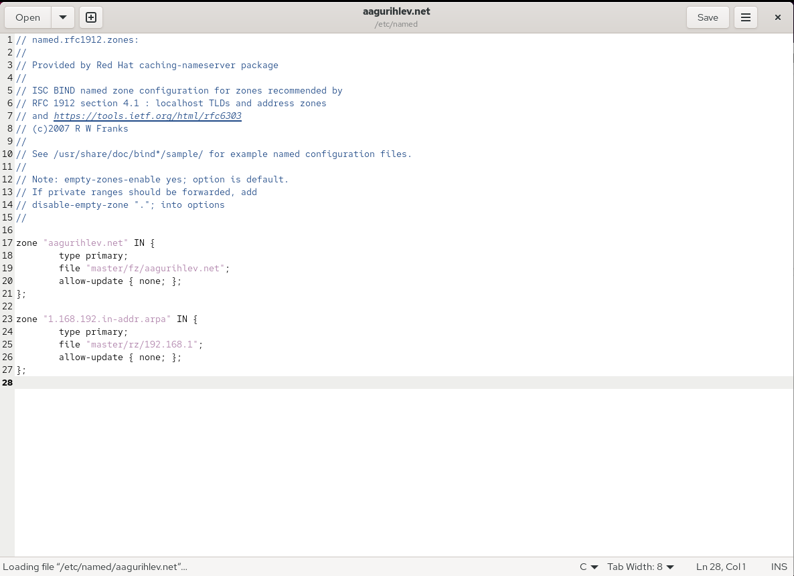{#fig-017}

Скопируем шаблон файла прямой зоны.([рис. @fig-018])

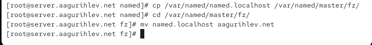{#fig-018}

Отредактируем файл прямой зоны согласно лабораторной работе.([рис. @fig-019])

{#fig-019}

Скопируем шаблон файла обратной зоны.([рис. @fig-020])

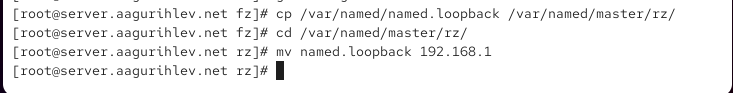{#fig-020}

Отредактируем файл обратной зоны согласно лабораторной работе.([рис. @fig-021])

{#fig-021}

Исправим права доступа для нужных файлов.([рис. @fig-022])

{#fig-022}

Восстановим метки SELinux.([рис. @fig-023])

{#fig-023}

Также проверим состояние его переключателей.([рис. @fig-024])

{#fig-024}

Проверим корректность работы сервера, просмотрев журнал сообщений системы.([рис. @fig-025])

{#fig-025}

Все зоны были успешно запущены, и сервер работает правильно, как показывает журнал.([рис. @fig-026])

{#fig-026}

Командой dig проведём запрос к нашему доменному имени.([рис. @fig-027])

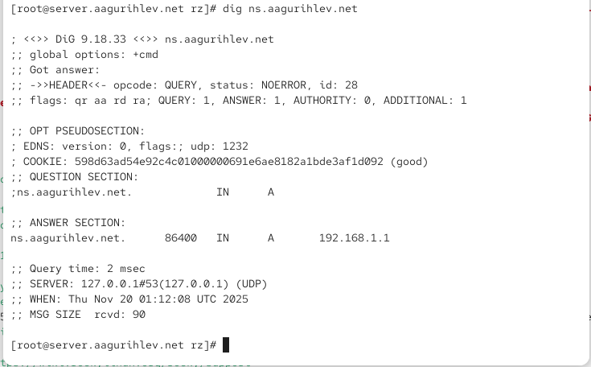{#fig-027}

Другими командами подтвердим корректность работы DNS сервера.([рис. @fig-028])

{#fig-028}

Создадим provision скрипт для виртуальной машины server.([рис. @fig-029])

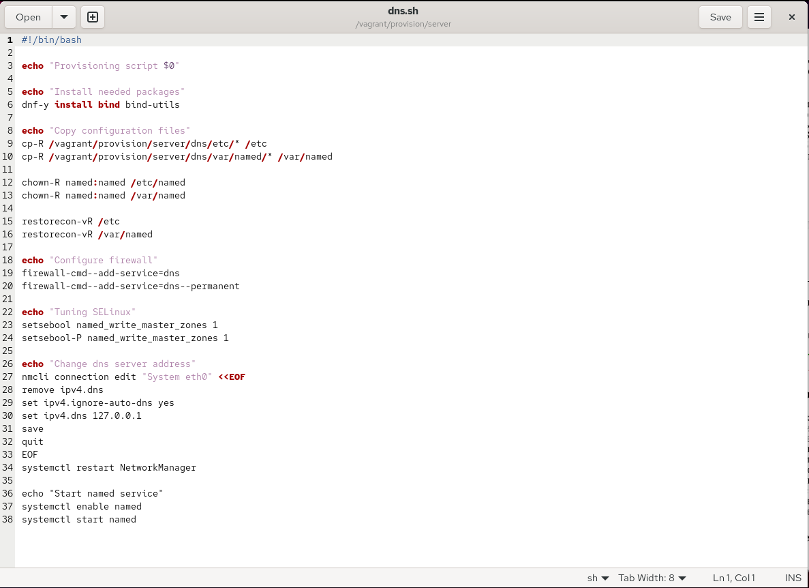{#fig-029}

Добавим этот скрипт в Vagrantfile.([рис. @fig-030])

{#fig-030}

# Выводы

В этой лабораторной работе я установил и сконфигурировал DNS сервер, а также научился принципам работы системы доменных имён.
