---
## Author
author:
  name: Гурылев Артем Андреевич
  email: 1132236135@pfur.ru
  affiliation:
    - name: Российский университет дружбы народов
## Title
title: Лабораторная работа №3
subtitle: Настройка DHCP-сервера
license: CC BY
date: today
date-format: "YYYY-MM-DD"
---

# Информация

## Докладчик

  * Гурылев Артем Андреевич
  * Студент
  * Российский университет дружбы народов им. П. Лумумбы

## Цель работы

- Целью работы является приобретение практических навыков по установке и конфигурированию DHCP сервера.

# Выполнение лабораторной работы

## Редактирование конфигурационного файла DHCP

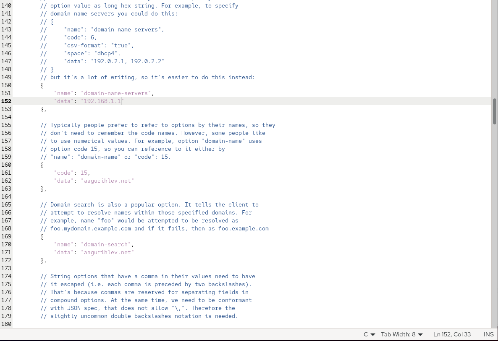{height=80%}

## Конфигурация подсети

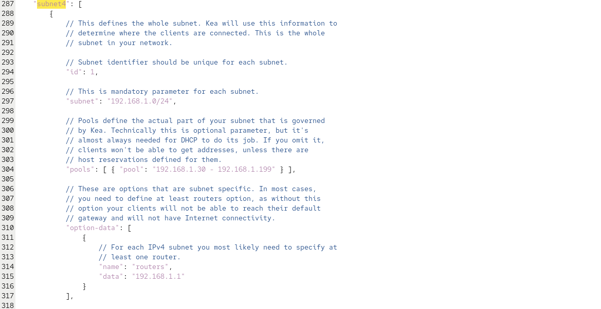{height=80%}

## Проверка конфигурационного файла

{height=80%}

## Проверка конфигурационного файла

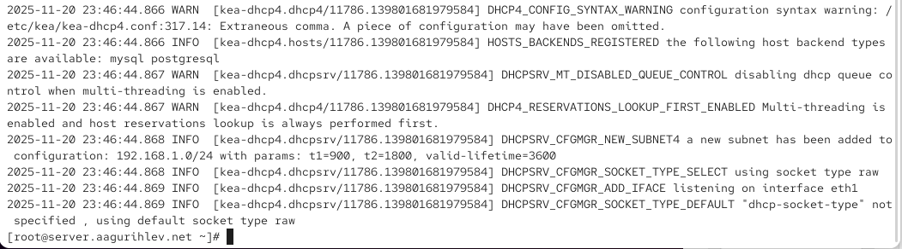{height=80%}

## Включение DHCP сервера

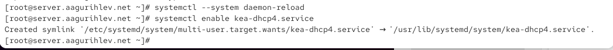{height=80%}

## Добавление DHCP в файл прямой зоны DNS

{height=80%}

## Добавление DHCP в файл обратной зоны DNS

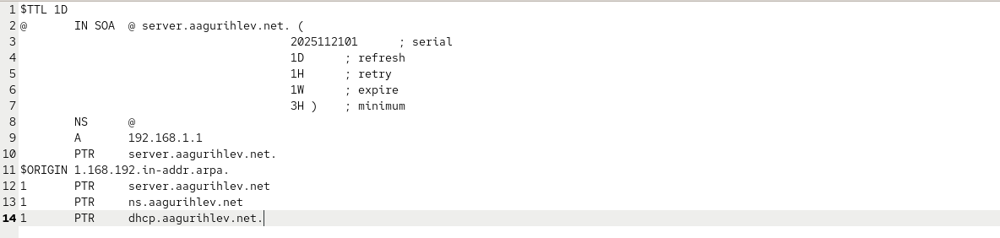{height=80%}

## Пинг DHCP сервера

{height=80%}

## Добавление DHCP в межсетевой экран

{height=80%}

## Запуск DHCP сервера в журнале

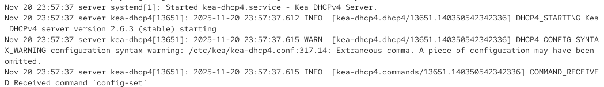{height=80%}

## Создание provision скрипта для виртуальной машины server

{height=80%}

## Генерация ключа

{height=80%}

## Добавление ключа в конфигурационный файл DNS сервера

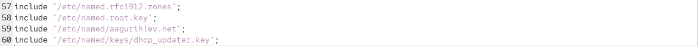{height=80%}

## Редактирование файла описания DNS зон

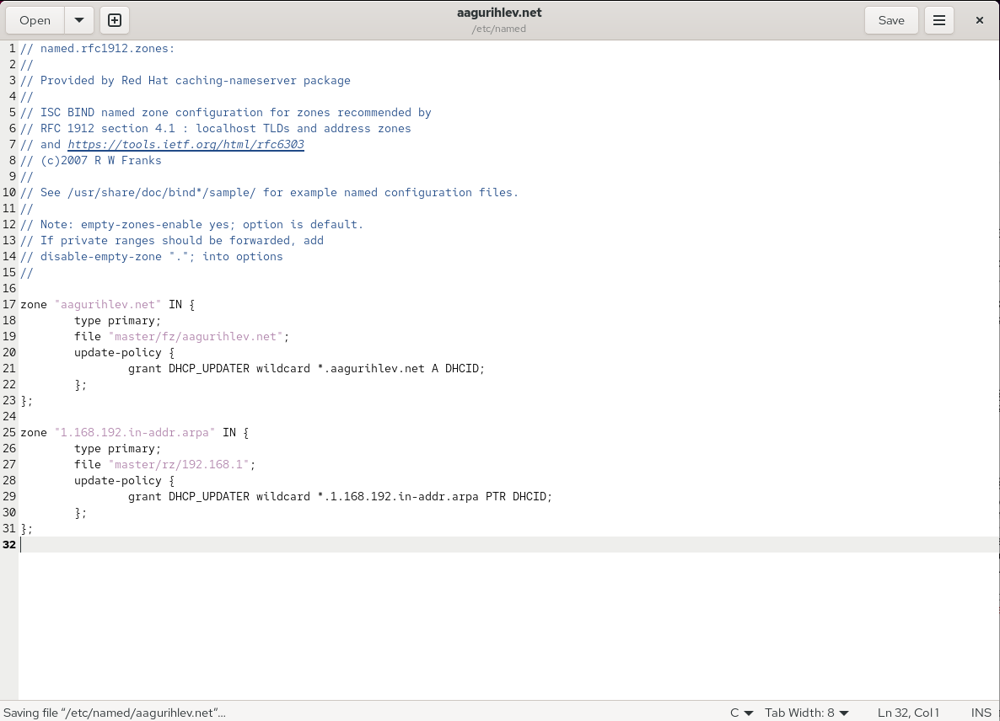{height=80%}

## Копирование ключа в отведённый файл DHCP сервера

{height=80%}

## Редактирование конфигурационного файла DHCP сервера

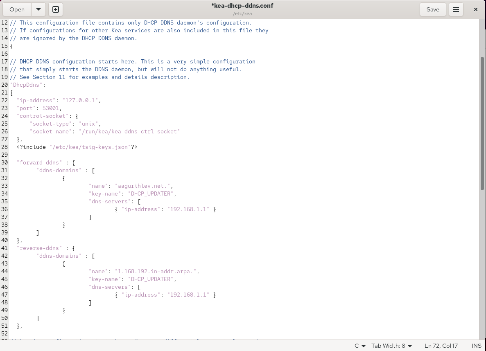{height=80%}

## Сообщение о запуске сервера

{height=80%}

## Просмотр выданных IP адресов сервером

{height=80%}

## Выданный IP адрес на клиенте

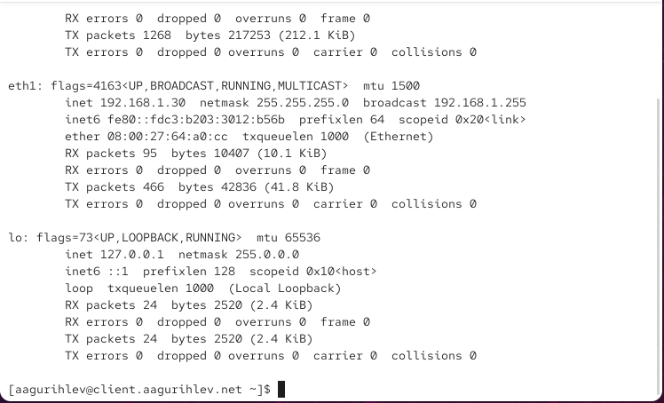{height=80%}

## Настройка файла DHCP сервера

{height=80%}

## Проверка конфигурационного файла

{height=80%}

## Включение службы DHCP сервера

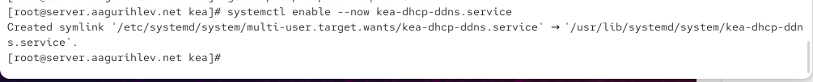{height=80%}

## Статус DHCP сервера

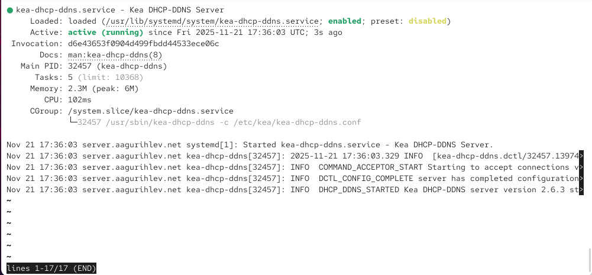{height=80%}

## Изменение конфигурационного файла DHCP сервера

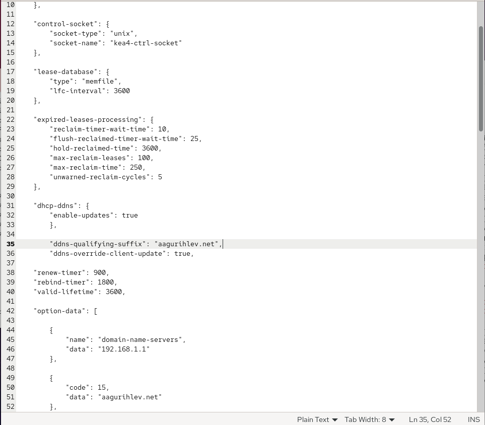{height=80%}

## Статус DHCP сервера

{height=80%}

## Проверка сервера командой dig

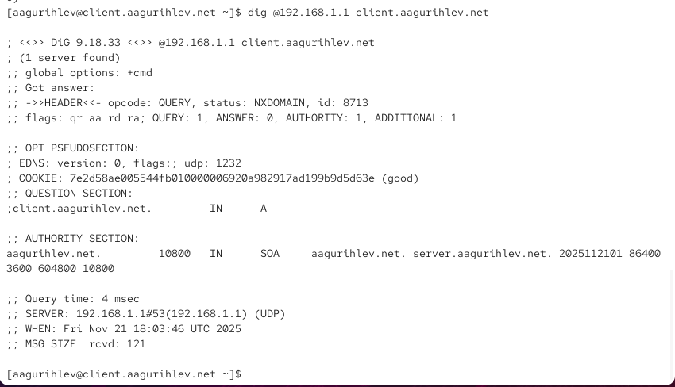{height=80%}

## Создание provision скрипта для server

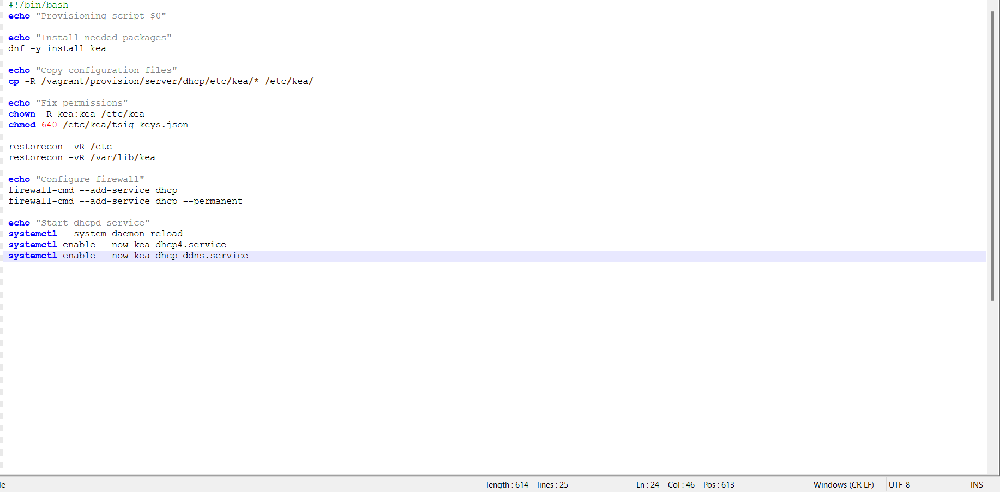{height=80%}

## Подключение provision скрипта в Vagrantfile

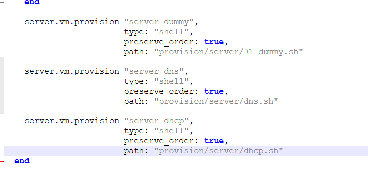{height=80%}

## Выводы

В этой лабораторной работе я установил и сконфигурировал DHCP сервер.

