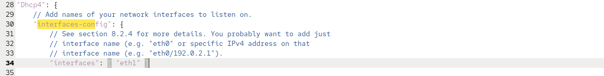
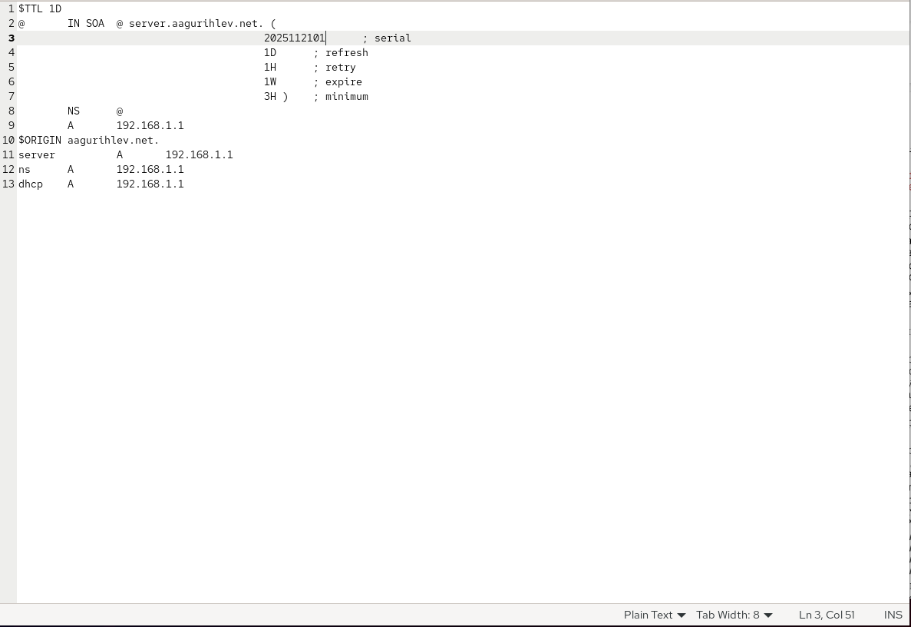
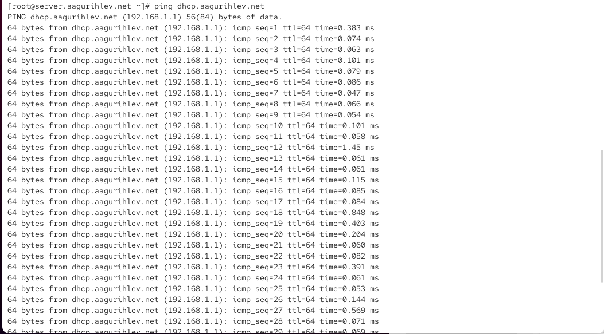
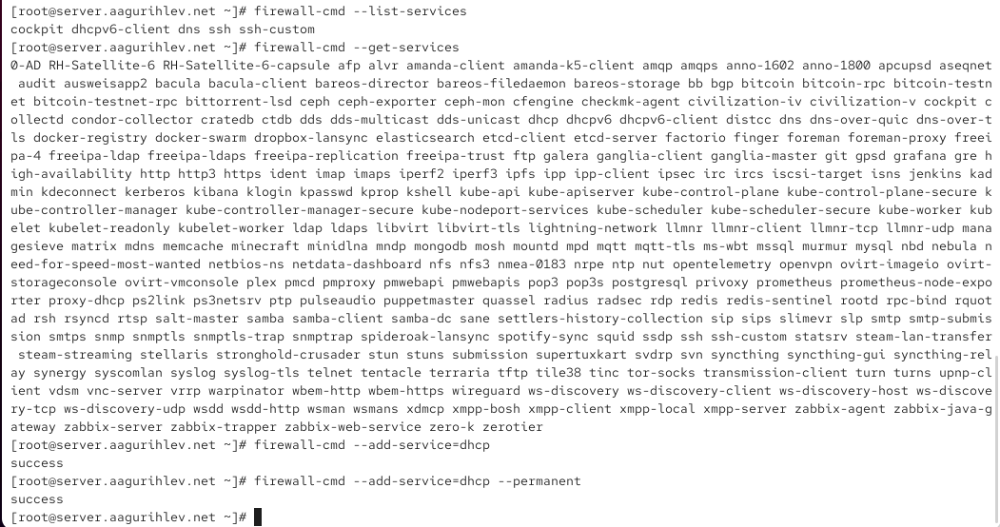
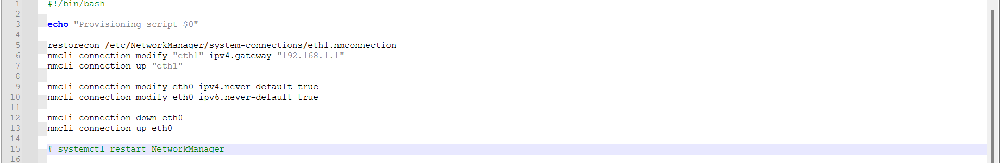
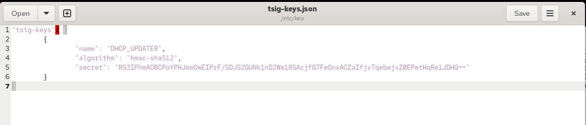
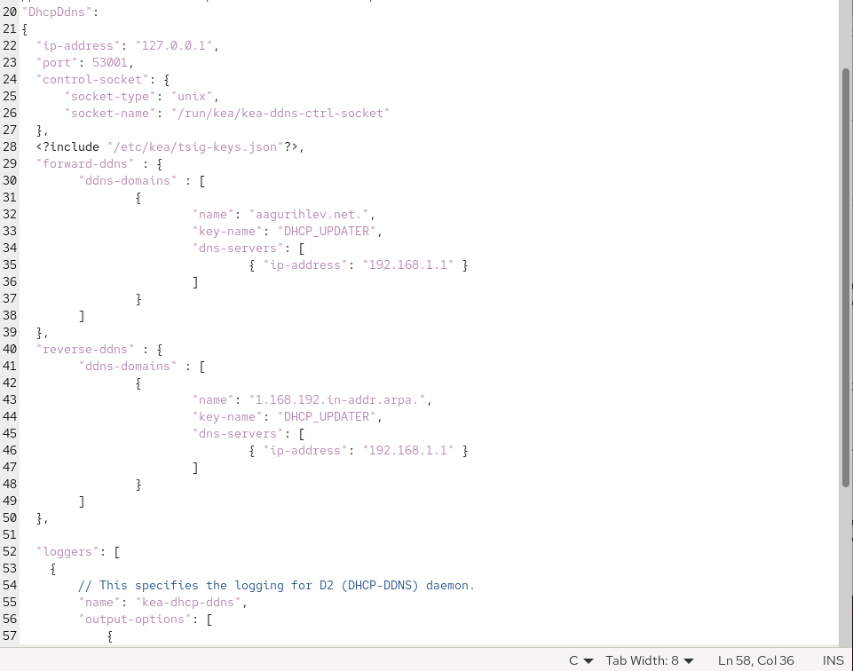
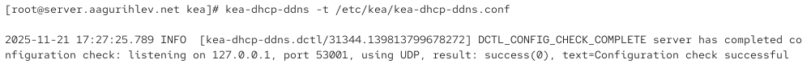
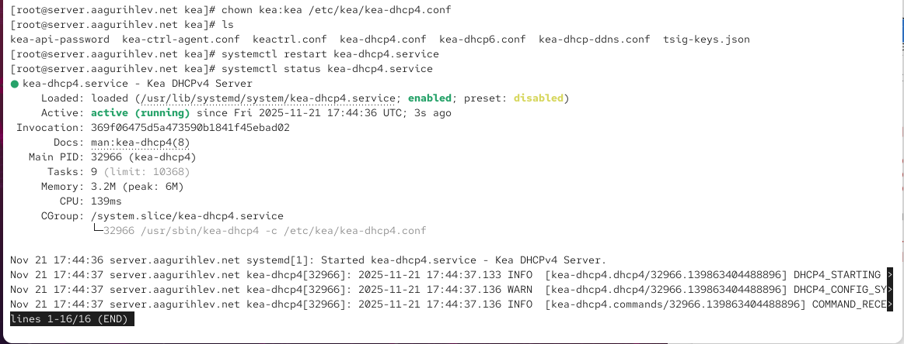

---
## Author
author:
  name: Гурылев Артем Андреевич
  email: 1132236135@pfur.ru
  affiliation:
    - name: Российский университет дружбы народов

## Title
title: "Лабораторная работа №3"
subtitle: "Настройка DHCP-сервера"
license: "CC BY"
---

# Цель работы

Целью работы является приобретение практических навыков по установке и конфигурированию DHCP сервера.

# Выполнение лабораторной работы

После установки DHCP сервера начнем его конфигурацию согласно лабораторной работе.([рис. @fig-001])

{#fig-001}

Добавим в конфигурационный файл подсеть согласно лабораторной работе.([рис. @fig-002])

{#fig-002}

Добавим нужный сетевой интерфейс.([рис. @fig-003])

{#fig-003}

Проверим конфигурационный файл на наличие ошибок.([рис. @fig-004])

{#fig-004}

Включим DHCP сервер.([рис. @fig-005])

{#fig-005}

Добавим адрес DHCP сервера в файл прямой зоны DNS.([рис. @fig-006])

{#fig-006}

Добавим адрес DHCP сервера в файл обратной зоны DNS.([рис. @fig-007])

{#fig-007}

Продолжим работу.([рис. @fig-008])

{#fig-008}

Продолжим работу.([рис. @fig-009])

{#fig-009}

Продолжим работу.([рис. @fig-010])

{#fig-010}

Продолжим работу. Создадим provision скрипт.([рис. @fig-011])

{#fig-011}

Сгенерируем ключ для сервера.([рис. @fig-012])

{#fig-012}

Продолжим работу.([рис. @fig-013])

{#fig-013}

Продолжим работу.([рис. @fig-014])

{#fig-014}

Продолжим работу.([рис. @fig-015])

{#fig-015}

Продолжим работу.([рис. @fig-016])

{#fig-016}

Продолжим работу.([рис. @fig-017])

{#fig-017}

Продолжим работу.([рис. @fig-018])

{#fig-018}

Продолжим работу.([рис. @fig-019])

{#fig-019}

Продолжим работу.([рис. @fig-020])

{#fig-020}

([рис. @fig-021])

{#fig-021}

Продолжим работу.([рис. @fig-022])

{#fig-022}

Продолжим работу.([рис. @fig-023])

{#fig-023}

Продолжим работу.([рис. @fig-024])

{#fig-024}

Продолжим работу.([рис. @fig-025])

{#fig-025}

Продолжим работу.([рис. @fig-026])

{#fig-026}

([рис. @fig-027])

{#fig-027}

([рис. @fig-028])

{#fig-028}

# Выводы

В этой лабораторной работе я установил и сконфигурировал DHCP сервер.
