---
## Author
author:
  name: Гурылев Артем Андреевич
  email: 1132236135@pfur.ru
  affiliation:
    - name: Российский университет дружбы народов
## Title
title: Лабораторная работа №4
subtitle: Базовая настройка HTTP-сервера Apache
license: CC BY
date: today
date-format: "YYYY-MM-DD"
---

# Информация

## Докладчик

  * Гурылев Артем Андреевич
  * Студент
  * Российский университет дружбы народов им. П. Лумумбы

## Цель работы

- Целью работы является приобретение практических навыков по установке и базовому конфигурированию HTTP-сервера Apache.

# Выполнение лабораторной работы

## Конфигурационные файлы каталога /etc/httpd/conf

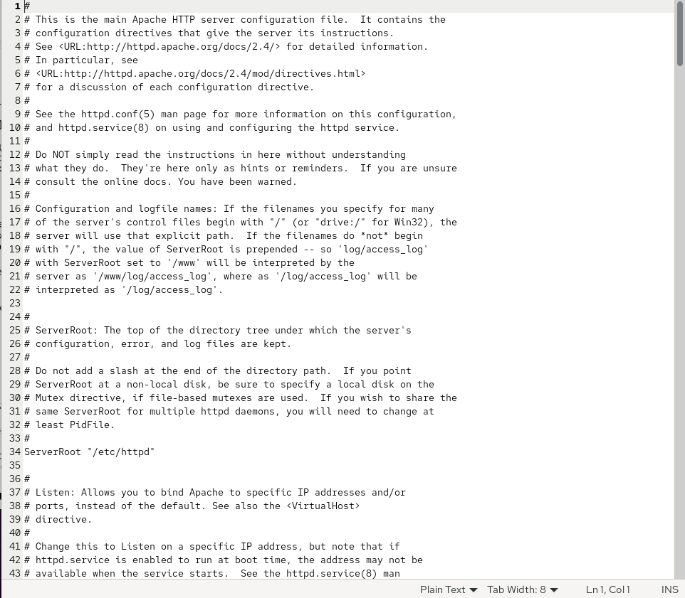{height=80%}

## Конфигурационные файлы каталога /etc/httpd/conf

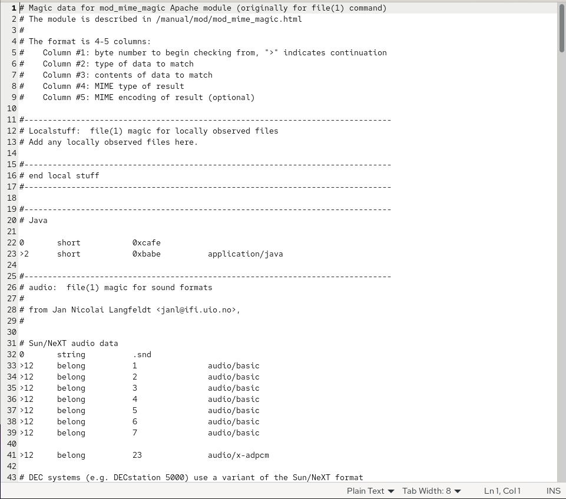{height=80%}

## Конфигурационные файлы каталога /etc/httpd/conf.d

{height=80%}

## Конфигурационные файлы каталога /etc/httpd/conf.d

{height=80%}

## Конфигурационные файлы каталога /etc/httpd/conf.d

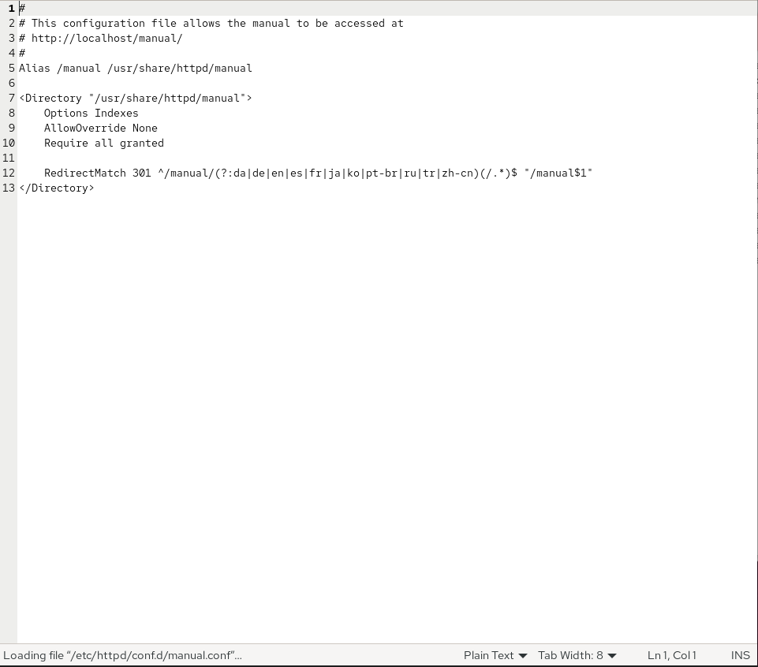{height=80%}

## Конфигурационные файлы каталога /etc/httpd/conf.d

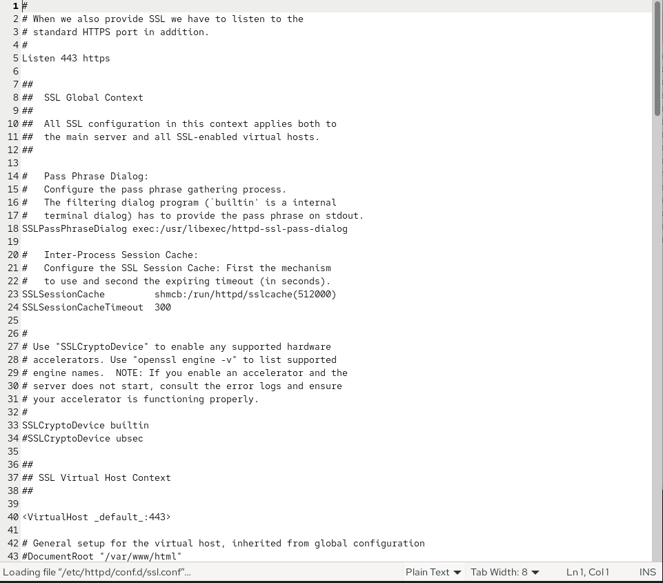{height=80%}

## Конфигурационные файлы каталога /etc/httpd/conf.d

{height=80%}

## Конфигурационные файлы каталога /etc/httpd/conf.d

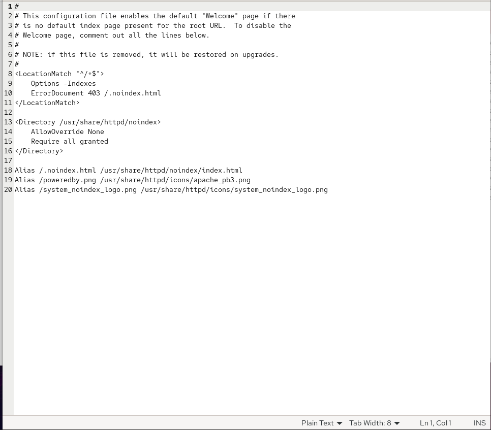{height=80%}

## Конфигурация HTTP-сервера

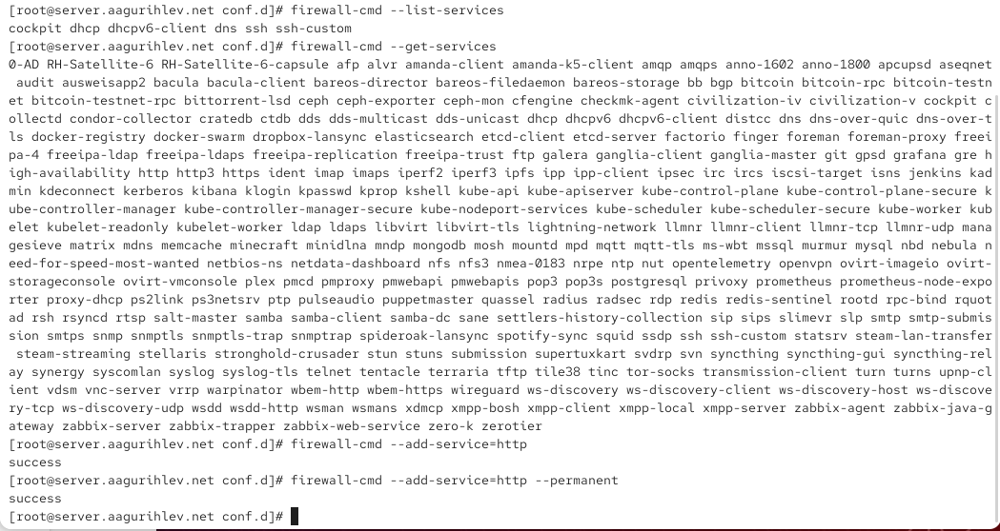{height=80%}

## Конфигурация HTTP-сервера

## Журнал команды journalctl

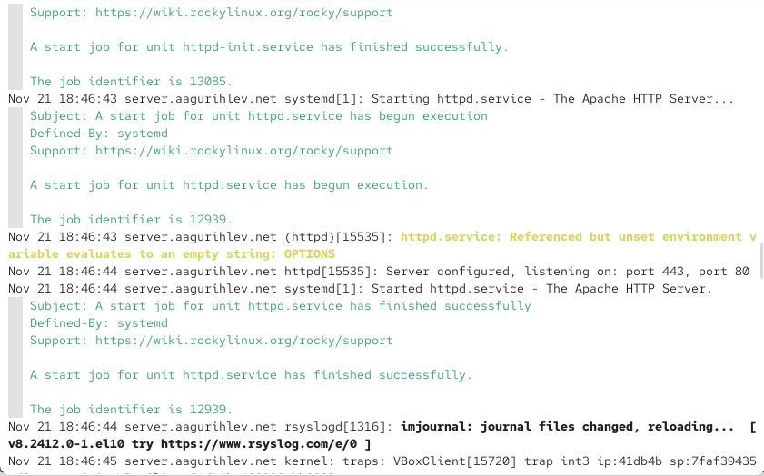{height=80%}

## error_log

{height=80%}

## Страница сервера в браузере клиента

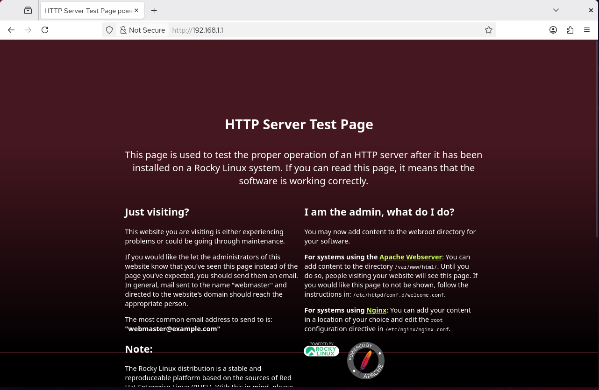{height=80%}

## access_log

## aagurihlev.net

## 192.168.1

## server.aagurihlev.net.conf

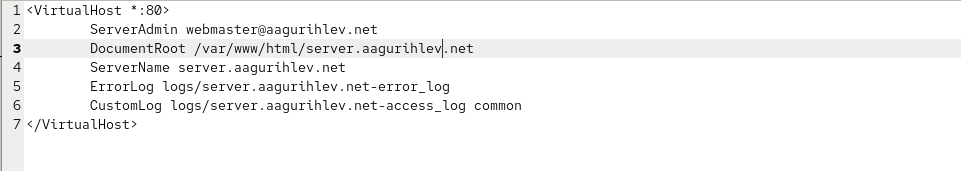

## www.aagurihlev.net.conf

## Создание тестовых страниц

## Создание тестовых страниц

## Создание тестовых страниц

## Создание тестовых страниц

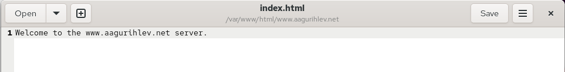

## Корректирование доступа

## Страницы сервера в браузере

## Страницы сервера в браузере

## Внесение изменений во внутреннее окружение Vagrant

## Создание скрипта provision

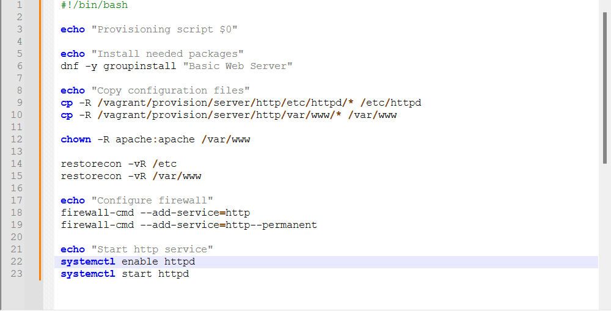{height=80%}

## Изменение Vagrantfile

{height=80%}

## Выводы

- В результате выполнения этой лабораторной работы были получены навыки настройки и работы с HTTP-сервером Apache.