---
## Author
author:
  name: Гурылев Артем Андреевич
  email: 1132236135@pfur.ru
  affiliation:
    - name: Российский университет дружбы народов

## Title
title: "Лабораторная работа №4"
subtitle: "Базовая настройка HTTP-сервера Apache"
license: "CC BY"
---

# Цель работы

Целью работы является приобретение практических навыков по установке и базовому конфигурированию HTTP-сервера Apache.

# Выполнение лабораторной работы

Откроем каталоги /etc/httpd/conf и /etc/httpd/conf.d, и посмотрим на конфигурационные файлы в них.

В файле httpd.conf содержатся настройки и инструкции для http-сервера. ([рис. @fig-001])

{#fig-001}

Файл magic нужен Apache-серверу для определения типов разных файлов по их содержанию. ([рис. @fig-002])

{#fig-002}

Файл autoindex.conf нужен для автоматической генерации индексных страниц. ([рис. @fig-003])

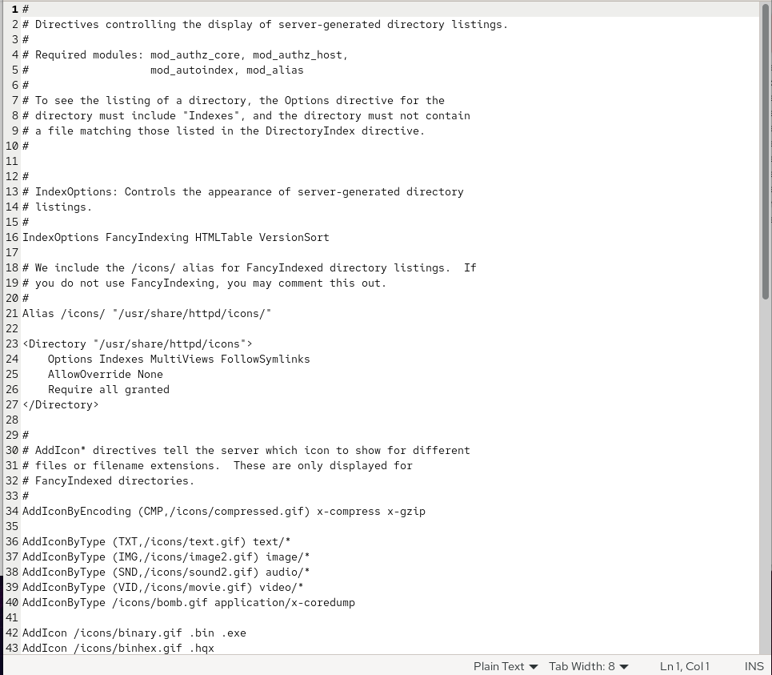{#fig-003}

Файл fcgid.conf содержит конфигурацию модуля FastCGI-поддержки для запуска внешних приложений. ([рис. @fig-004])

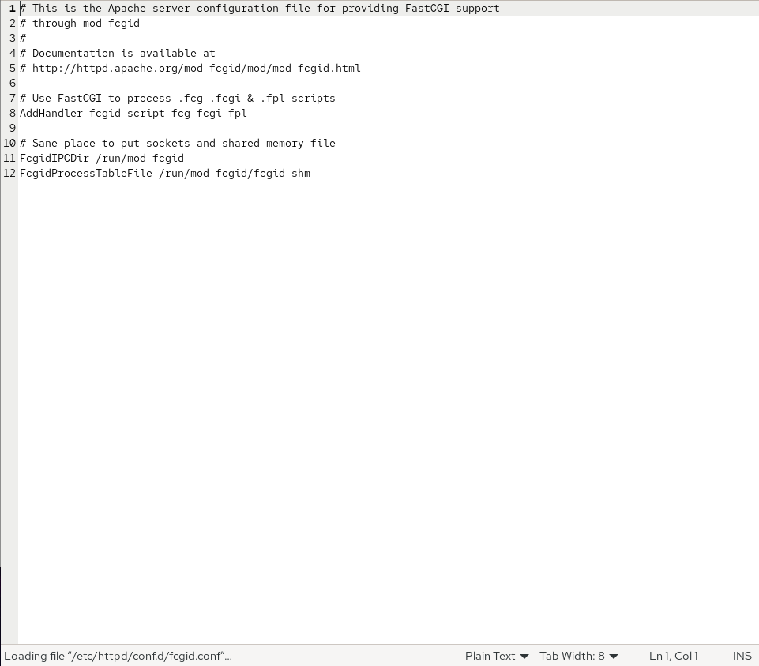{#fig-004}

Файл manual.conf содержит конфигурацию встроенной в Apache HTML‑документации. ([рис. @fig-005])

{#fig-005}

Файл ssl.conf содержит конфигурацию SSL/TLS для HTTP-сервера. ([рис. @fig-006])

{#fig-006}

Файл userdir.conf настраивает поддержку пользовательских публичных веб‑каталогов(ссылки вида http://host/~username/). ([рис. @fig-007])

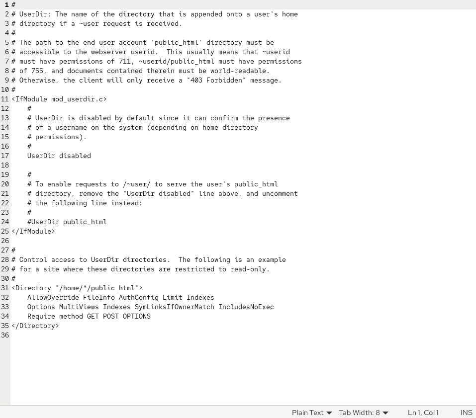{#fig-007}

Файл welcome.conf содержит настройку приветственной страницы Apache. ([рис. @fig-008])

{#fig-008}

Сконфигурируем межсетевой экран и добавим службу сервера, после чего запустим его.([рис. @fig-009], [рис. @fig-010])

{#fig-009}

{#fig-010}

Посмотрим журнал командой journalctl, и увидим, что сервер успешно запустился.([рис. @fig-011])

{#fig-011}

Откроем журнал ошибок сервера.([рис. @fig-012])

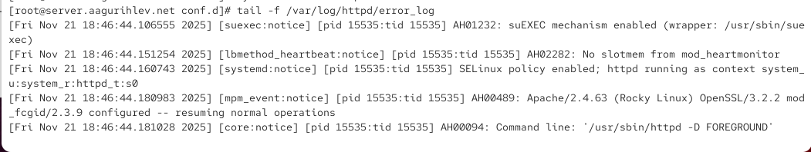{#fig-012}

Откроем журнал мониторинга доступа, затем на клиенте зайдём на страницу ip-адреса сервера в браузере. Нас встретит приветственная страница Apache.([рис. @fig-013])

{#fig-013}

Просмотрим информацию мониторинга сервера. Как мы можем заметить, в нём отображаются запросы с клиента и информация о нём - ip-адрес, браузер, его веб-движок, система и прочие. ([рис. @fig-014])

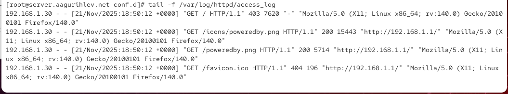{#fig-014}

Теперь добавим в файл конфигурации прямой DNS зоны запись о нашем HTTP-сервере.([рис. @fig-015])

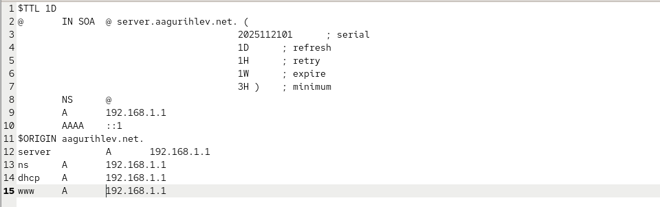{#fig-015}

Также добавим запись о сервер и в файл обратной DNS зоны.([рис. @fig-016])

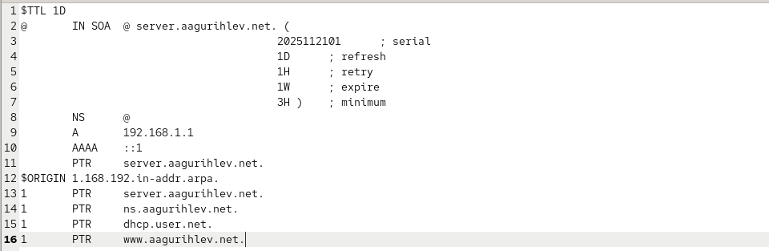{#fig-016}

Создадим новые конфигурационные файлы для страниц сервера в каталоге /etc/httpd/conf.d. Внесём содержание в файл server.aagurihlev.net.conf.([рис. @fig-017])

{#fig-017}

Теперь внесём содержание в www.aagurihlev.net.conf.([рис. @fig-018])

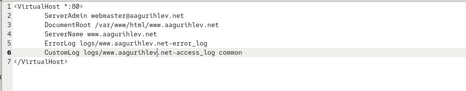{#fig-018}

В каталоге /var/www/html создадим тестовые страницы для сервера, сначала для server.aagurihlev.net.([рис. @fig-019])

{#fig-019}

Добавим содержание в этот файл. ([рис. @fig-020])

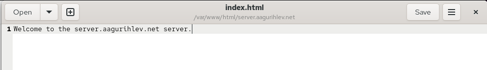{#fig-020}

Создадим тестовую страницу для www.aagurihlev.net.([рис. @fig-021])

{#fig-021}

Также добавим в него содержание.([рис. @fig-022])

{#fig-022}

После этого скорректируем владельца всех файлов каталога /var/www, восстановим контекст SELinux, и перезапустим HTTP-сервер.([рис. @fig-023]) 

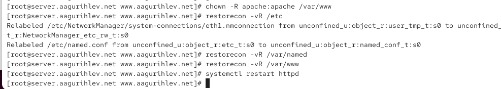{#fig-023}

Для проверки зайдем на страницу server.aagurihlev.net в браузере клиента. Содержание страницы такое же, как мы и указали.([рис. @fig-024])

{#fig-024}

Также зайдём и на страницу www.aagurihlev.net.([рис. @fig-025])

{#fig-025}

Теперь внесём изменения во внутреннее окружение Vagrant.([рис. @fig-026])

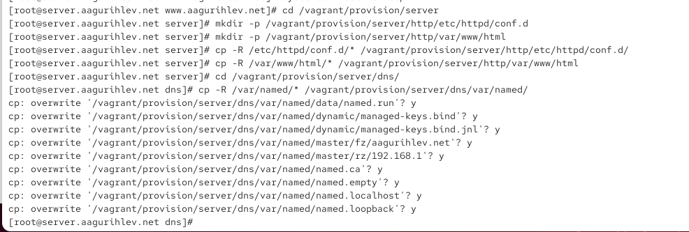{#fig-026}

Добавим provision скрипт для сервера, который обеспечит установку и работу HTTP-сервера.([рис. @fig-027])

{#fig-027}

Добавим этот скрипт в Vagrantfile.([рис. @fig-028])

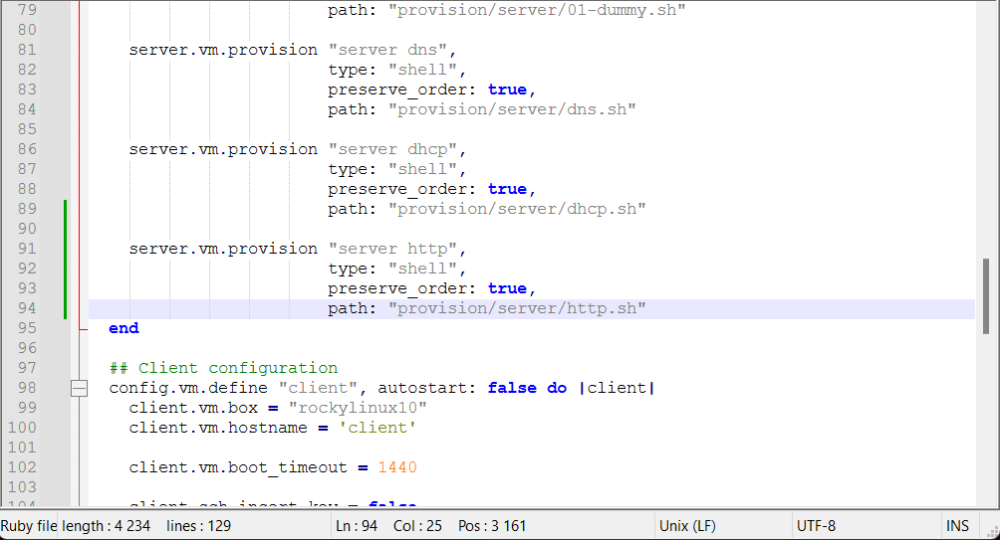{#fig-028}

# Выводы

В этой лабораторной работе были получены навыки настройки и работы с HTTP-сервером Apache.