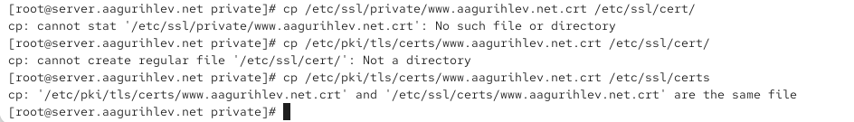
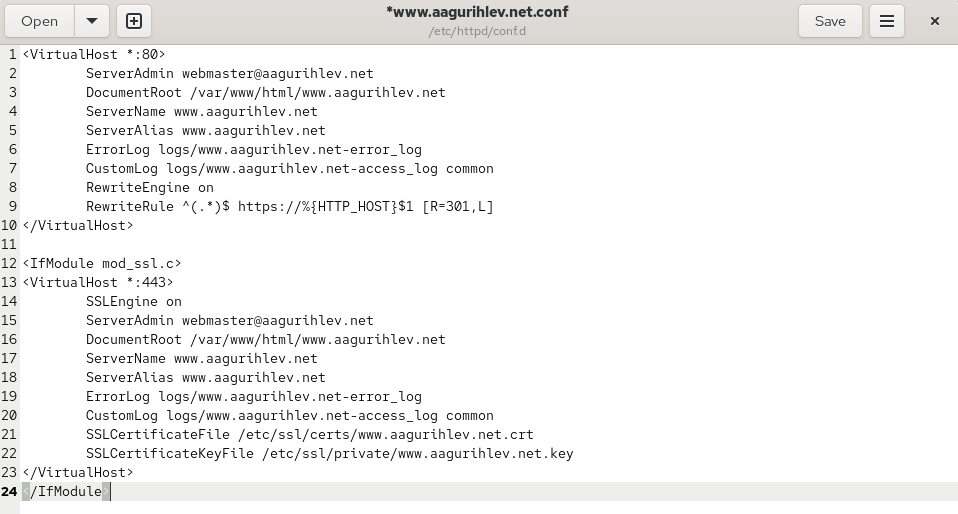
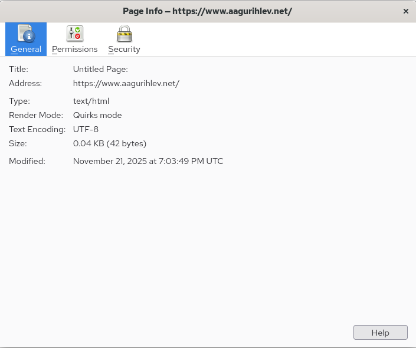
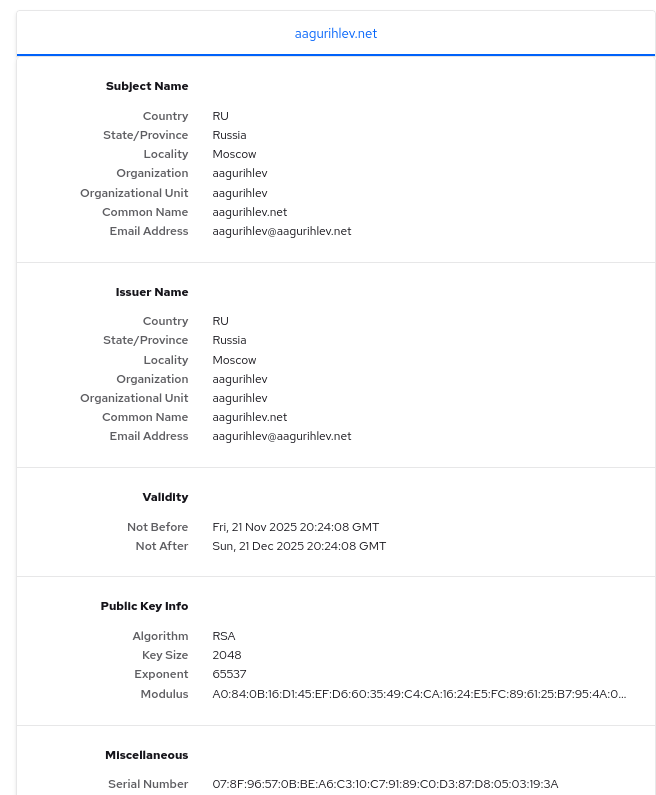
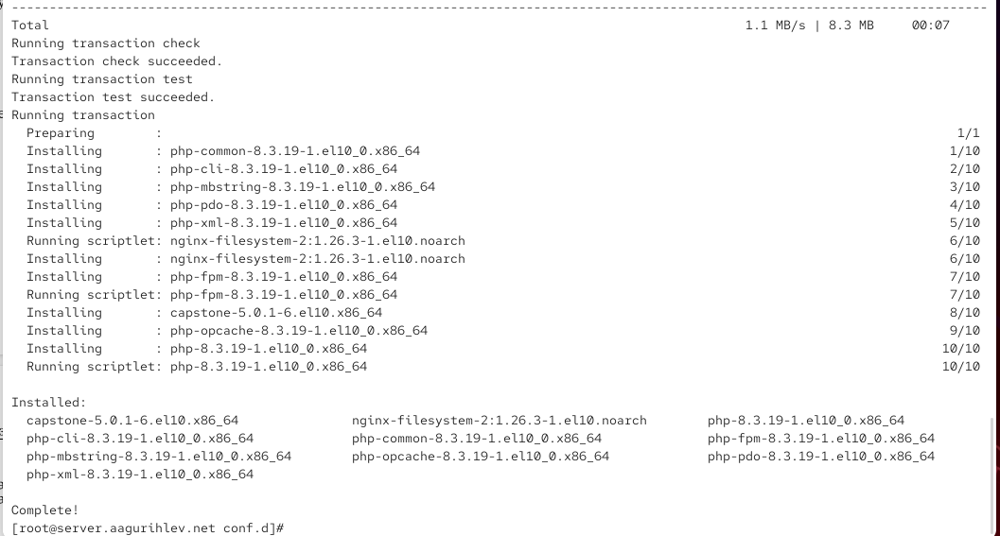

---
## Author
author:
  name: Гурылев Артем Андреевич
  email: 1132236135@pfur.ru
  affiliation:
    - name: Российский университет дружбы народов
## Title
title: Лабораторная работа №5
subtitle: Расширенная настройка HTTP-сервера Apache
license: CC BY
date: today
date-format: "YYYY-MM-DD"
---

# Информация

## Докладчик

  * Гурылев Артем Андреевич
  * Студент
  * Российский университет дружбы народов им. П. Лумумбы

## Цель работы

- Целью данной лабораторной работы является расширенная настройка HTTP-сервера Apache.

# Выполнение лабораторной работы

## Создание каталога private

{height=80%}

## Генерация ключа

{height=80%}

## Копирование сертификата

{height=80%}

## Изменение файла www.aagurihlev.net.conf

{height=80%}

## Конфигурация межсетевого экрана и запуск https сервера

{height=80%}

## Информация о странице

{height=80%}

## Сертификат страницы

{height=80%}

## Установка php

{height=80%}

## Содержание index.php

{height=80%}

## Страница с информацией о php

{height=80%}

## Внесение изменений в окружение vagrant

{height=80%}

## Изменение provision скрипта http

{height=80%}

## Выводы

В результате выполнения лабораторной работы были получены практические навыки по расширенному конфигурированию HTTP сервера Apache.