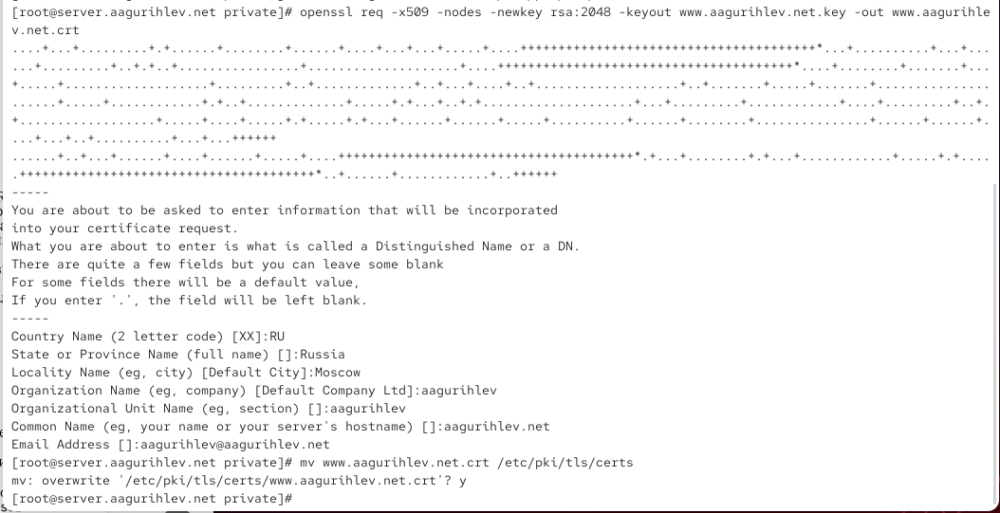
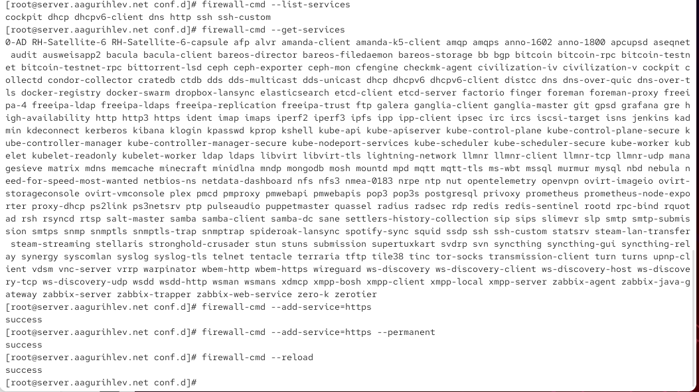
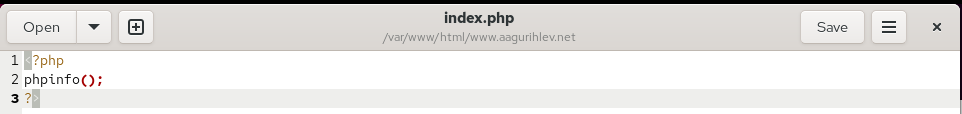
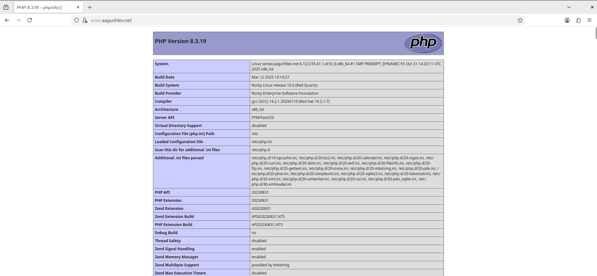
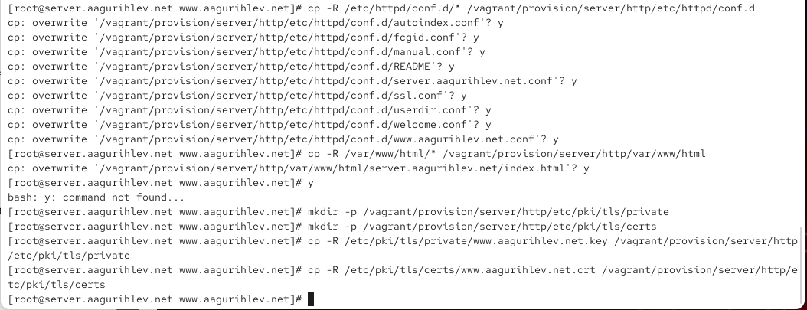
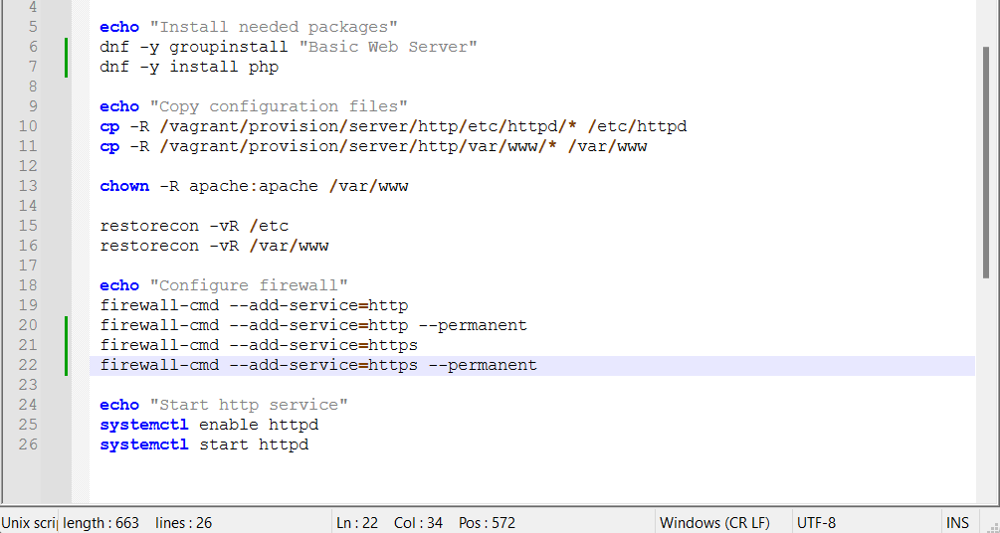

---
## Author
author:
  name: Гурылев Артем Андреевич
  email: 1132236135@pfur.ru
  affiliation:
    - name: Российский университет дружбы народов

## Title
title: "Лабораторная работа №5"
subtitle: "Расширенная настройка HTTP-сервера Apache"
license: "CC BY"
---

# Цель работы

Целью лабораторной работы является приобретение практических навыков по расширенному конфигурированию HTTP сервера Apache в части безопасности и возможности использования PHP.

# Выполнение лабораторной работы

Перейдём в режим суперпользователя, и создадим каталог private.([рис. @fig-001])

{#fig-001}

Начнем генерировать сертификат, и заполним его.([рис. @fig-002])

{#fig-002}

Скопируем сертификат в каталог.([рис. @fig-003])

{#fig-003}

Теперь дополним файл www.user.net.conf. Мы добавили конфигурацию для модуля ssl сайта, что нужно для работы HTTPS соединения. Мы указываем админа сервера, корневую папку документов, имя сервера, путь к журналу ошибок и обычному журналу, а также путь к файлу сертификата и ключа сертификата.([рис. @fig-004])

{#fig-004}

После изменения файла внесём изменения в настройки межсетевого экрана, и добавим сервер HTTPS.([рис. @fig-005])

{#fig-005}

C клиента зайдем на www.aagurihlev.net и увидим, что теперь соединение с сайтом идет через https.([рис. @fig-006])

{#fig-006}

Посмотрим информацию о сертификате, которым подписан наш сайт.([рис. @fig-007])

{#fig-007}

Теперь установим php.([рис. @fig-008])

{#fig-008}

Заменим index.html на index.php. Пропишем в нем скрипт, который покажет информацию о нашей версии php на странице.([рис. @fig-009])

{#fig-009}

Зайдем на страницу с клиента, и увидим информацию о версии php.([рис. @fig-010])

{#fig-010}

Внесём изменения в окружение Vagrant, создав нужные каталоги и скопировав файлы конфигурации и сертификат.([рис. @fig-011])

{#fig-011}

Немного изменим скрипт, добавив туда https.([рис. @fig-012])

{#fig-012}

# Выводы

В этой лабораторной работе были приобретены навыки по расширенной настройке HTTP-сервера, и было настроено HTTPS соединение.