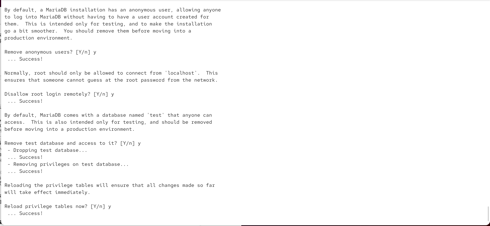
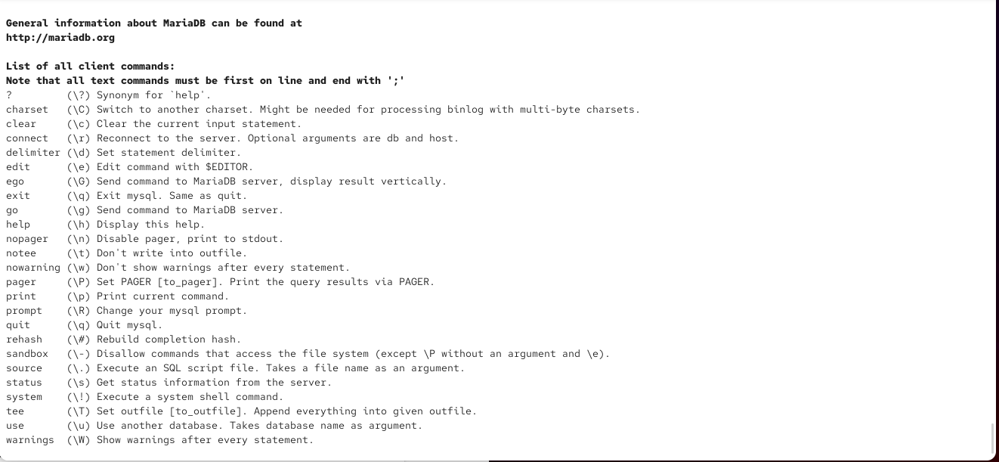
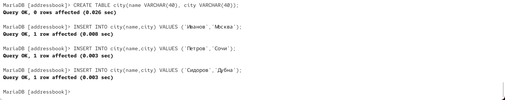
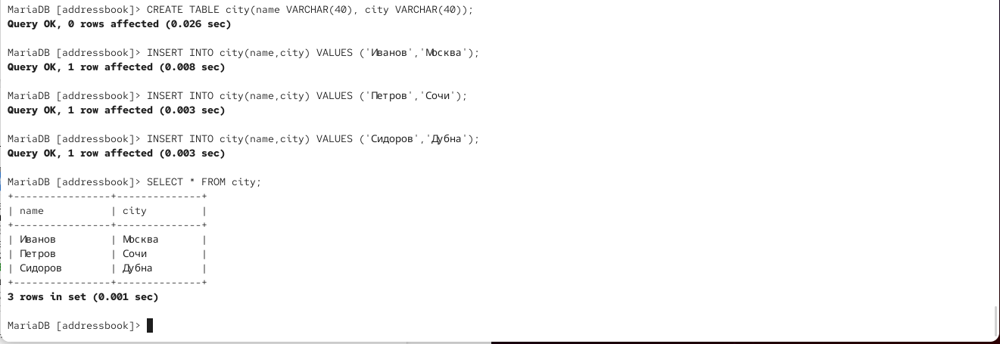
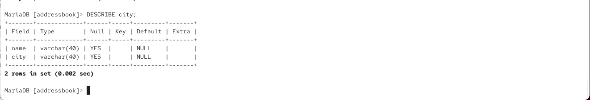
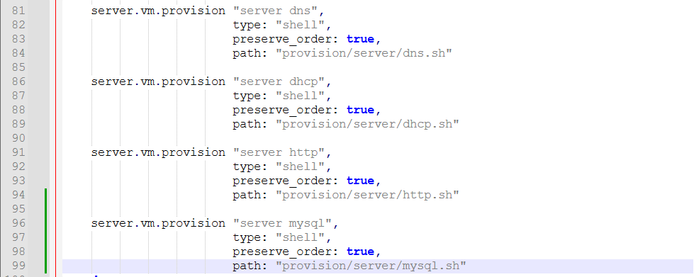

---
## Author
author:
  name: Гурылев Артем Андреевич
  email: 1132236135@pfur.ru
  affiliation:
    - name: Российский университет дружбы народов
## Title
title: Лабораторная работа №6
subtitle: Установка и настройка системы управления базами данных MariaDB
license: CC BY
date: today
date-format: "YYYY-MM-DD"
---

# Информация

## Докладчик

  * Гурылев Артем Андреевич
  * Студент
  * Российский университет дружбы народов им. П. Лумумбы

## Цель работы

- Целью лабораторной работы является приобретение практических навыков по установке и конфигурированию системы управления базами данных на примере программного обеспечения MariaDB.

# Выполнение лабораторной работы

## Установка mariadb

{height=80%}

## Конфигурационный файл mariadb

{height=80%}

## Включение mariadb

{height=80%}

## Первичная установка mariadb

{height=80%}

## Команды mariadb

{height=80%}

## Показ всех баз данных

{height=80%}

## Создание своей базы данных

{height=80%}

## Заполнение базы данных

{height=80%}

## Просмотр своей базы данных

{height=80%}

## Создание своего пользователя

{height=80%}

## Детальное описание базы данных

{height=80%}

## Просмотр всех баз данных нашего пользователя

{height=80%}

## Создание резервной копии баз данных

{height=80%}

## Подключение provision скрипта в Vagrantfile

{height=80%}

## Provision скрипт для виртуальной машины server

{height=80%}

## Общая информация о работе mariadb

{height=80%}

## Конфигурация правильной кодировки для баз данных

{height=80%}

## Информация о работе mariadb с дополненной кодировкой

{height=80%}

## Выводы

В этой лабораторной работе я настроил MariaDB и научился работать с базами данных.

