---
## Author
author:
  name: Гурылев Артем Андреевич
  email: 1132236135@pfur.ru
  affiliation:
    - name: Российский университет дружбы народов
## Title
title: Лабораторная работа №7
subtitle: Расширенные настройки межсетевого экрана
license: CC BY
date: today
date-format: "YYYY-MM-DD"
---

# Информация

## Докладчик

  * Гурылев Артем Андреевич
  * Студент
  * Российский университет дружбы народов им. П. Лумумбы

## Цель работы

- Целью лабораторной работы является получение навыков настройки межсетевого экрана в Linux в части переадресации портов и настройки Masquerading.

# Выполнение лабораторной работы

## 

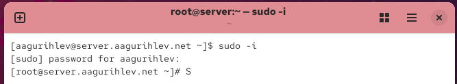{height=80%}

## 

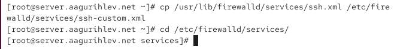{height=80%}

## 

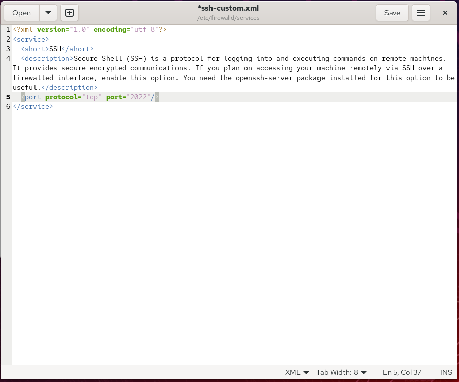{height=80%}

##

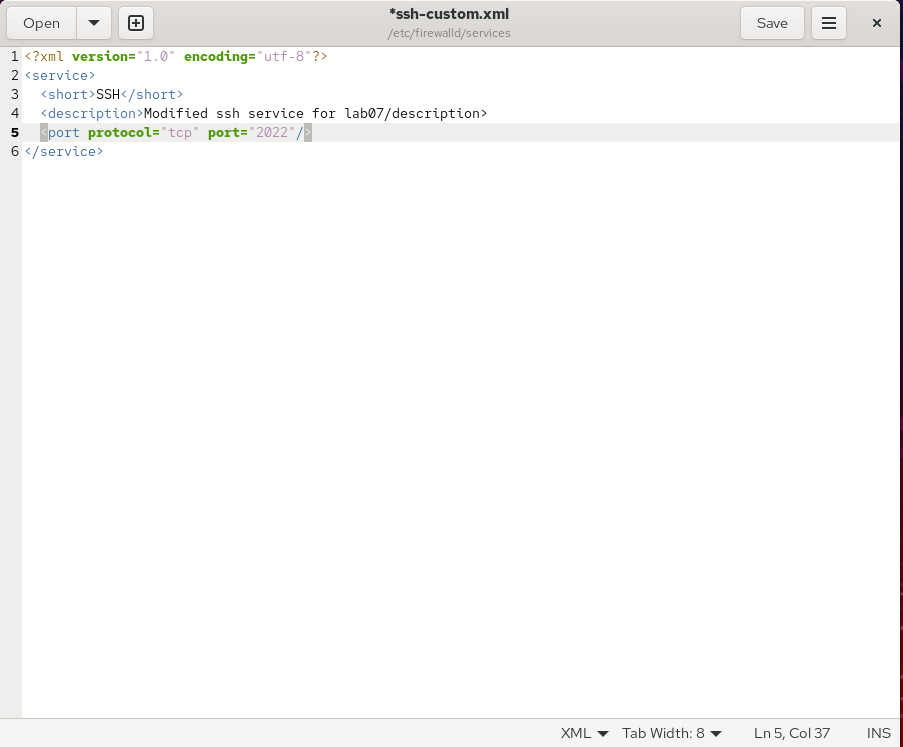{height=80%}

##

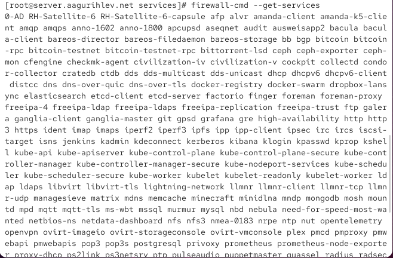{height=80%}

##

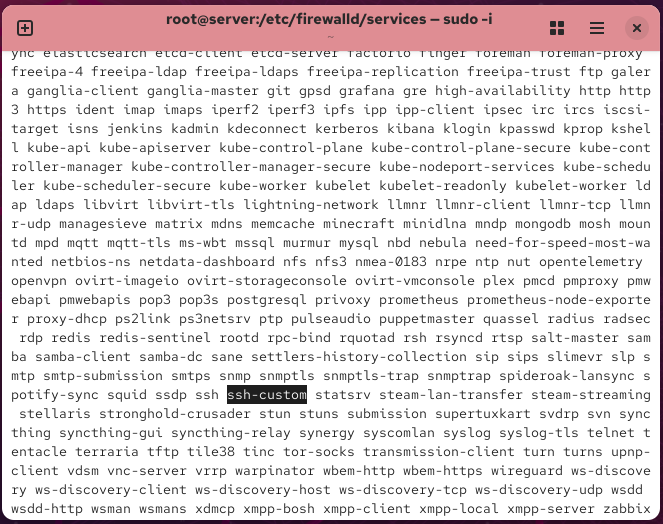{height=80%}

##

{height=80%}

##

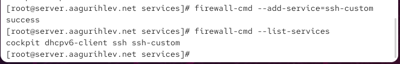{height=80%}

##

{height=80%}

##

{height=80%}

##

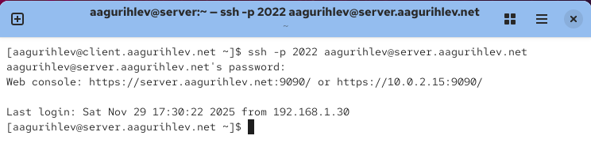{height=80%}

##

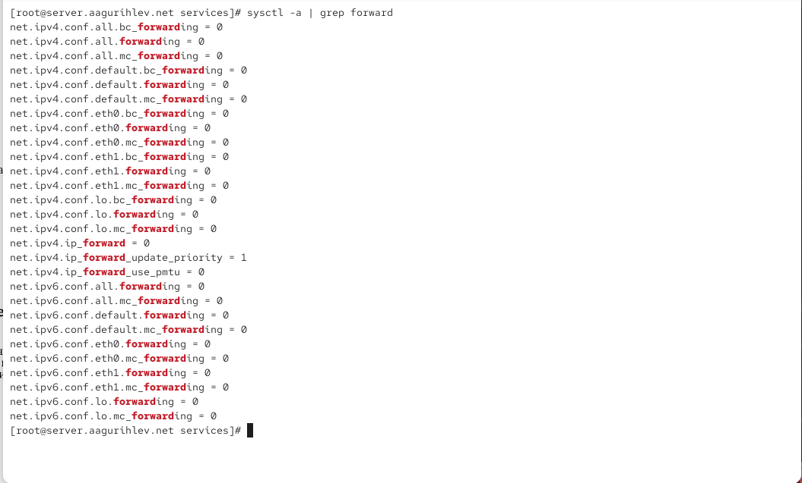{height=80%}

##

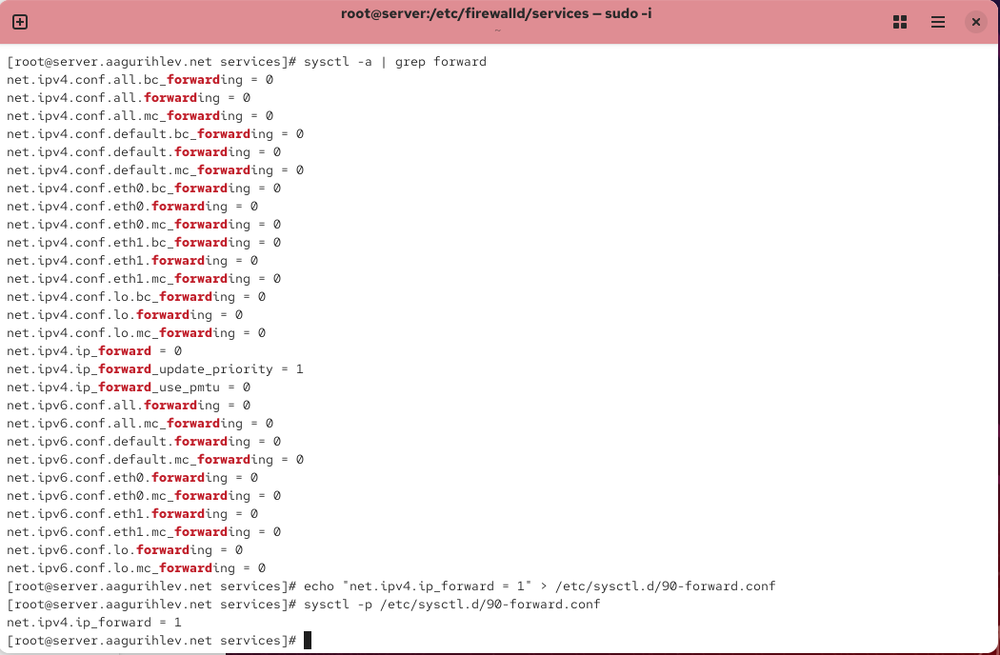{height=80%}

##

{height=80%}

##

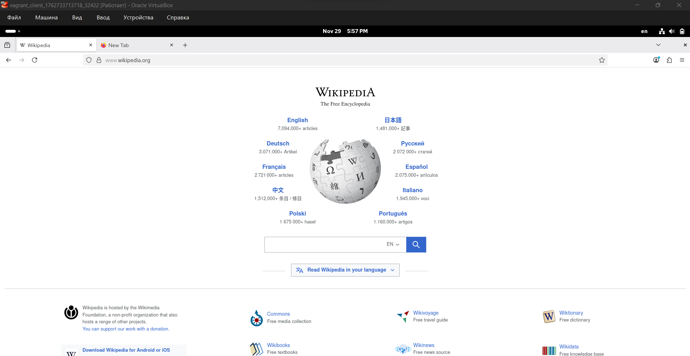{height=80%}

##

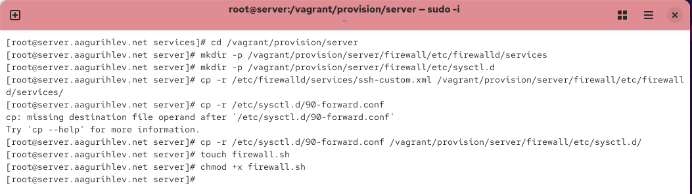{height=80%}

##

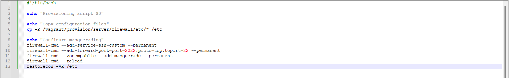{height=80%}

##

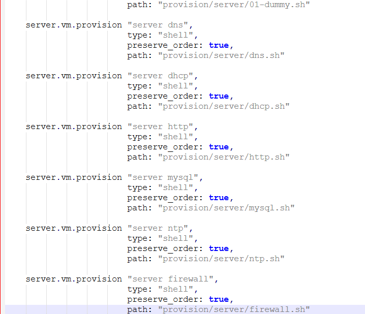{height=80%}

## Выводы

В этой лабораторной работе я настроил межсетевой экран в Linux, а также настроил переадресацию портов и Masquerading.

