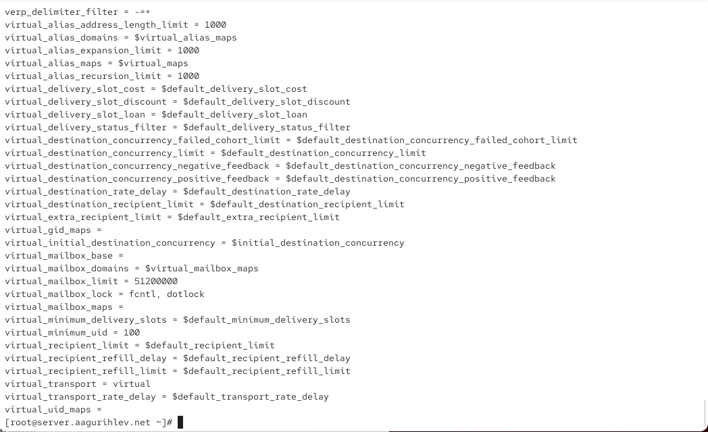
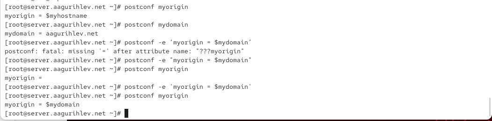
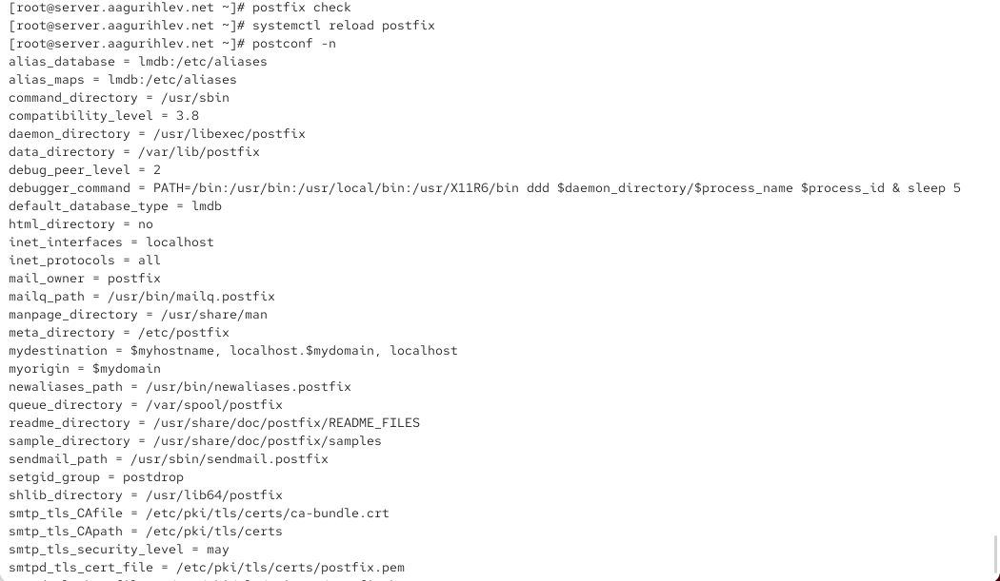
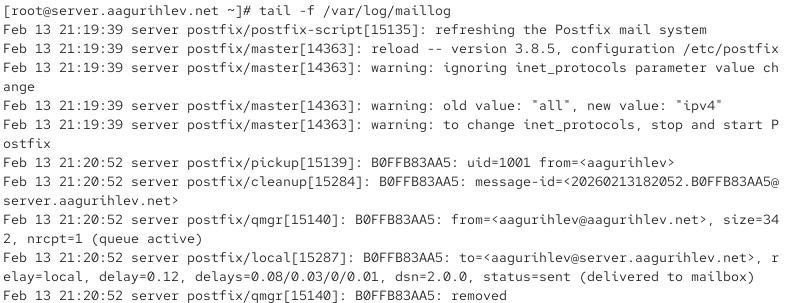
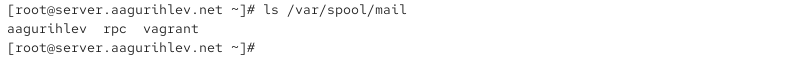
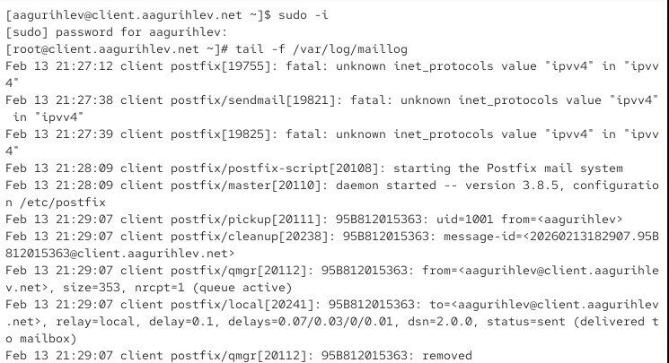
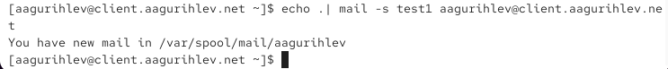
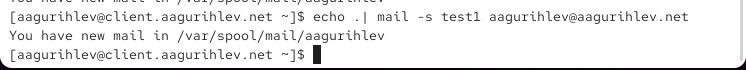
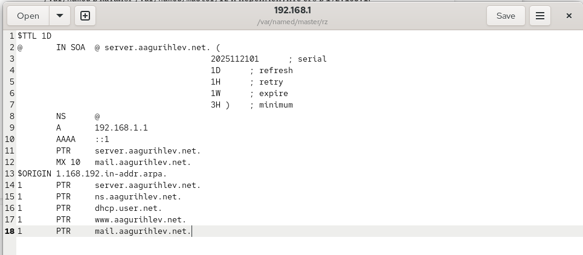
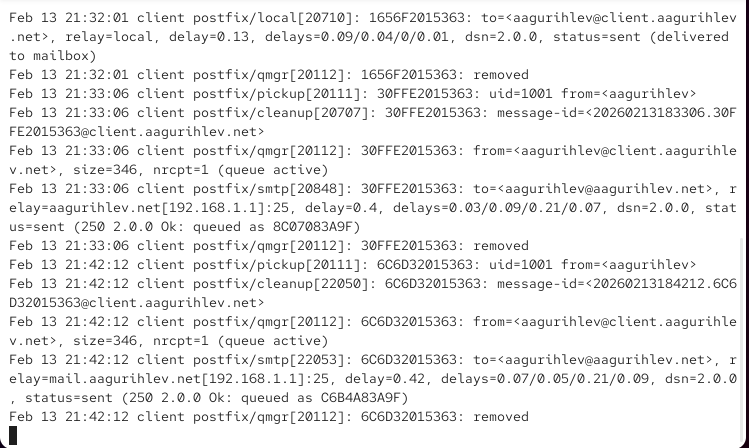

---
## Author
author:
  name: Гурылев Артем Андреевич
  email: 1132236135@pfur.ru
  affiliation:
    - name: Российский университет дружбы народов
## Title
title: Лабораторная работа №8
subtitle: Настройка SMTP-сервера
license: CC BY
date: today
date-format: "YYYY-MM-DD"
---

# Информация

## Докладчик

  * Гурылев Артем Андреевич
  * Студент
  * Российский университет дружбы народов им. П. Лумумбы

## Цель работы

- Целью данной лабораторной работы является приобретение практических навыков по установке и конфигурированию SMTP сервера.

# Выполнение лабораторной работы

##

{height=80%}

##

{height=80%}

##

{height=80%}

##

{height=80%}

##

{height=80%}

##

{height=80%}

##

{height=80%}

##

{height=80%}

##

{height=80%}

##

{height=80%}

##

{height=80%}

##

{height=80%}

##

{height=80%}

##

{height=80%}

##

{height=80%}

##

{height=80%}

##

{height=80%}

##

{height=80%}

##

{height=80%}

##

{height=80%}

## Выводы

В этой лабораторной работе я установил и конфигурировал SMTP-сервер.

