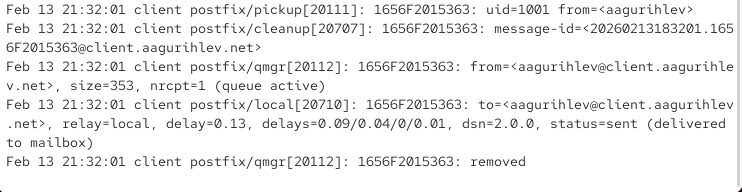
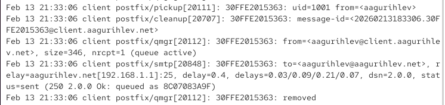
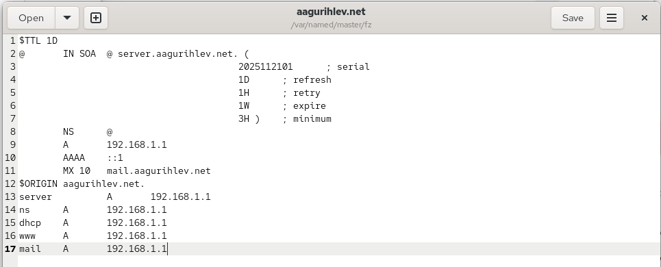
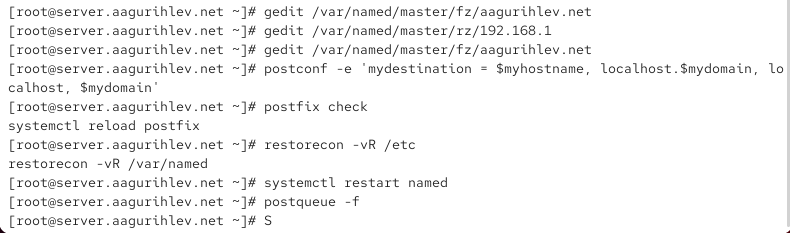
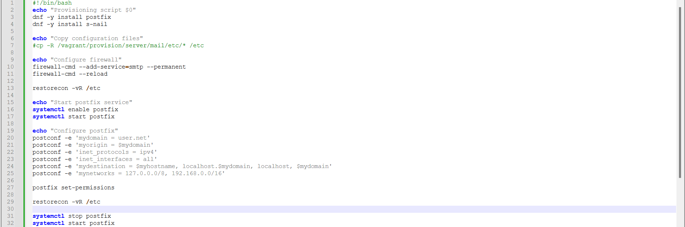
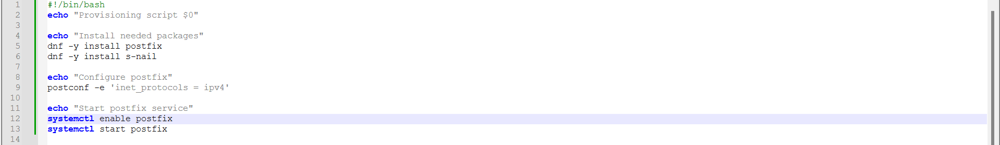
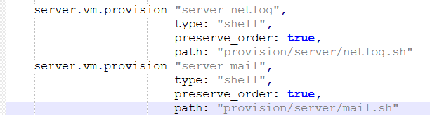
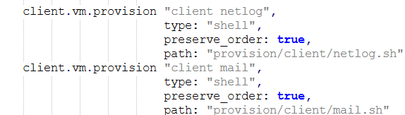

---
## Author
author:
  name: Гурылев Артем Андреевич
  email: 1132236135@pfur.ru
  affiliation:
    - name: Российский университет дружбы народов

## Title
title: "Лабораторная работа №8"
subtitle: "Настройка SMTP-сервера"
license: "CC BY"
---

# Цель работы

Целью данной лабораторной работы является приобретение практических навыков по установке и конфигурированию SMTP сервера.

# Выполнение лабораторной работы

([рис. @fig-001])

{#fig-001}

([рис. @fig-002])

{#fig-002}

([рис. @fig-003])

{#fig-003}

([рис. @fig-004])

{#fig-004}

([рис. @fig-005])

{#fig-005}

([рис. @fig-006])

{#fig-006}

([рис. @fig-007])

{#fig-007}

([рис. @fig-008])

{#fig-008}

([рис. @fig-009])

{#fig-009}

([рис. @fig-010])

{#fig-010}

([рис. @fig-011])

{#fig-011}

([рис. @fig-012])

{#fig-012}

([рис. @fig-013])

{#fig-013}

([рис. @fig-014])

{#fig-014}

([рис. @fig-015])

{#fig-015}

([рис. @fig-016])

{#fig-016}

([рис. @fig-017])

{#fig-017}

([рис. @fig-018])

{#fig-018}

([рис. @fig-019])

{#fig-019}

([рис. @fig-020])

{#fig-020}

# Выводы

В этой лабораторной работе я установил и конфигурировал SMTP-сервер.
