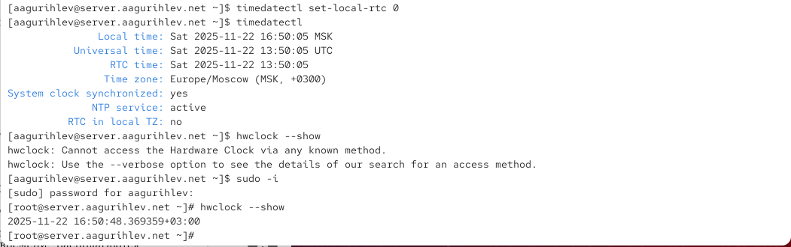
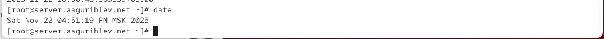
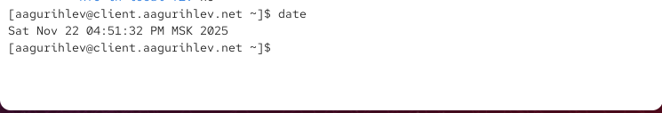
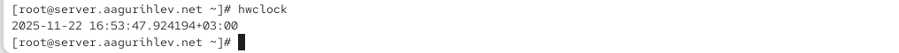
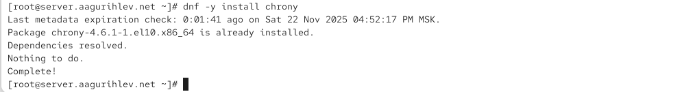
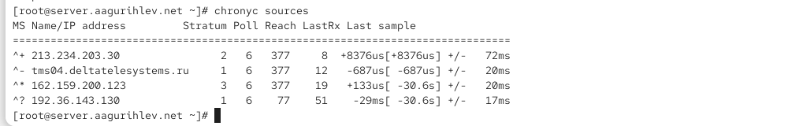
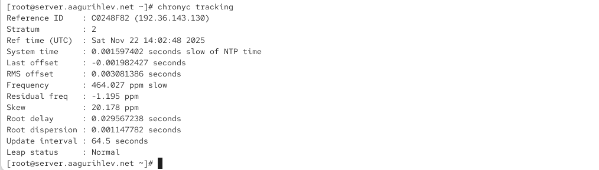

---
## Author
author:
  name: Гурылев Артем Андреевич
  email: 1132236135@pfur.ru
  affiliation:
    - name: Российский университет дружбы народов
## Title
title: Лабораторная работа №12
subtitle: Синхронизация времени
license: CC BY
date: today
date-format: "YYYY-MM-DD"
---

# Информация

## Докладчик

  * Гурылев Артем Андреевич
  * Студент
  * Российский университет дружбы народов им. П. Лумумбы

## Цель работы

- Целью данной лабораторной работы является

# Выполнение лабораторной работы

##

{#fig-001 height=80%}

##

{#fig-002 height=80%}

##

{#fig-003 height=80%}

##

{#fig-004 height=80%}

##

{#fig-005 height=80%}

##

{#fig-006 height=80%}

##

{#fig-007 height=80%}

##

{#fig-008 height=80%}

##

{#fig-009 height=80%}

##

{#fig-010 height=80%}

##

{#fig-011 height=80%}

##

{#fig-012 height=80%}

##

{#fig-013 height=80%}

##

{#fig-014 height=80%}

##

{#fig-015 height=80%}

##

{#fig-016 height=80%}

##

{#fig-017 height=80%}

##

{#fig-018 height=80%}

##

{#fig-019 height=80%}

##

{#fig-020 height=80%}

##

{#fig-021 height=80%}

##

{#fig-022 height=80%}

##

{#fig-023 height=80%}

##

{#fig-024 height=80%}

##

{#fig-025 height=80%}

##

{#fig-026 height=80%}

##

{#fig-027 height=80%}

## Выводы