---
## Author
author:
  name: Гурылев Артем Андреевич
  email: 1132236135@pfur.ru
  affiliation:
    - name: Российский университет дружбы народов

## Title
title: "Лабораторная работа №12"
subtitle: "Синхронизация времени"
license: "CC BY"
---

# Цель работы

Целью работы является получение навыков по управлению системным временем и настройке синхронизации времени.

# Выполнение лабораторной работы

Timedatectl на сервере ([рис. @fig-001])

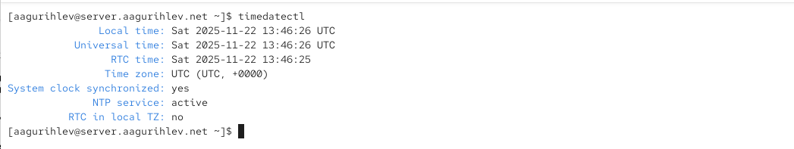{#fig-001 height=80%}

Timedatectl на клиенте ([рис. @fig-002])

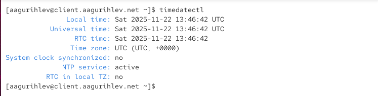{#fig-002 height=80%}

Список часовых поясов команды timedatectl ([рис. @fig-003])

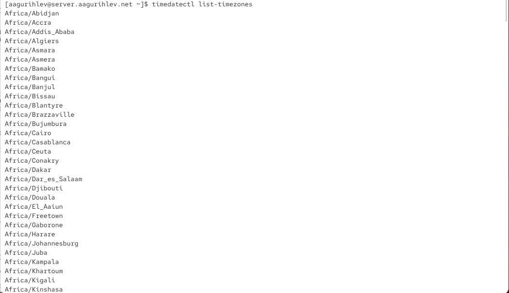{#fig-003 height=80%}

Установка часового пояса командой на сервере ([рис. @fig-004])

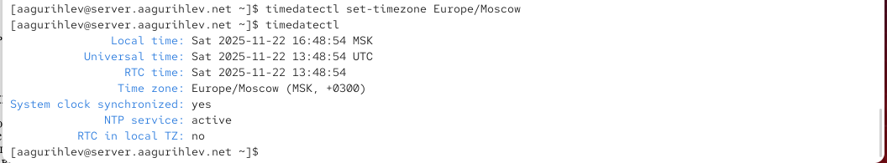{#fig-004 height=80%}

Установка часового пояса командой на клиенте ([рис. @fig-005])

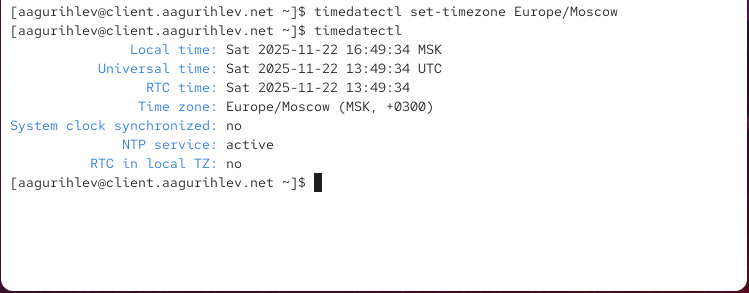{#fig-005 height=80%}

Установка аппаратного времени командой на сервере ([рис. @fig-006])

{#fig-006 height=80%}

Команда date сервера ([рис. @fig-007])

{#fig-007 height=80%}

Команда date клиента ([рис. @fig-008])

{#fig-008 height=80%}

Установка времени командой date на сервере ([рис. @fig-009])

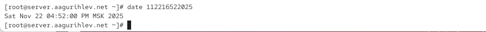{#fig-009 height=80%}

Установка времени командой date на клиенте ([рис. @fig-010])

{#fig-010 height=80%}

Аппаратное время на сервере ([рис. @fig-011])

{#fig-011 height=80%}

Аппаратное время на клиенте ([рис. @fig-012])

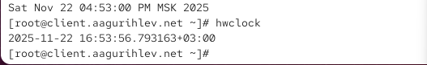{#fig-012 height=80%}

Установка chrony ([рис. @fig-013])

{#fig-013 height=80%}

Источники chrony сервера ([рис. @fig-014])

{#fig-014 height=80%}

Источники chrony клиента ([рис. @fig-015])

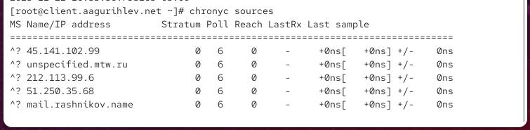{#fig-015 height=80%}

chrony.conf сервера ([рис. @fig-016])

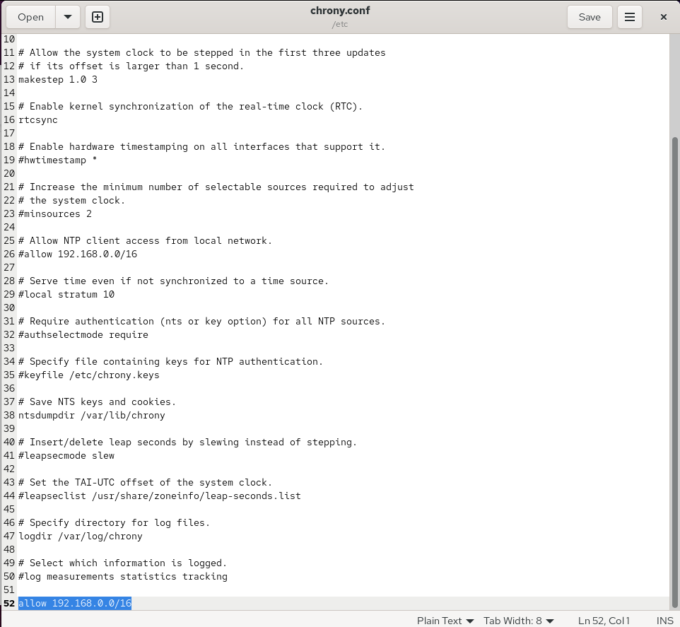{#fig-016 height=80%}

Перезапуск chronyd после конфигурации межсетевого экрана ([рис. @fig-017])

{#fig-017 height=80%}

chrony.conf клиента ([рис. @fig-018])

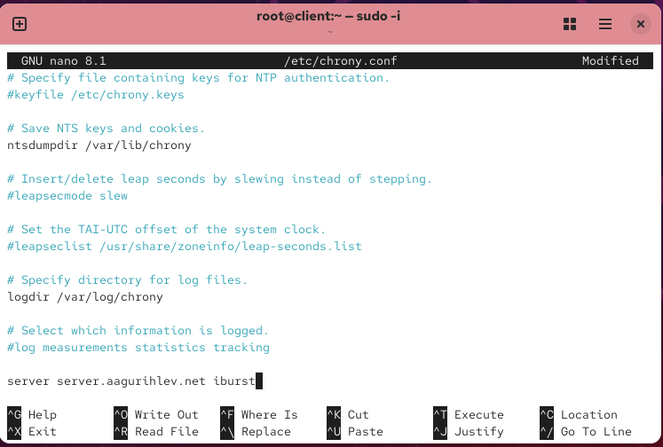{#fig-018 height=80%}

Источники chrony сервера после изменения конфигурации ([рис. @fig-019])

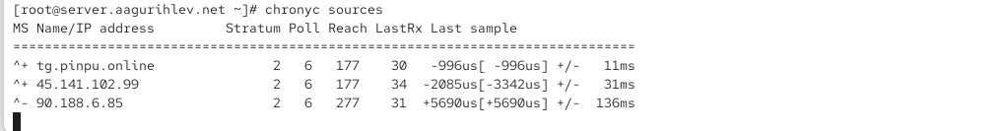{#fig-019 height=80%}

Источники chrony клиента после изменения конфигурации ([рис. @fig-020])

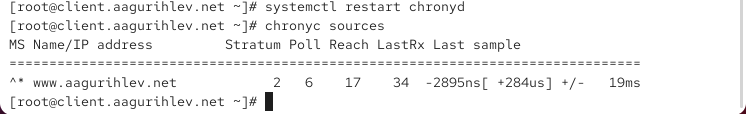{#fig-020 height=80%}

tracking chrony клиента ([рис. @fig-021])

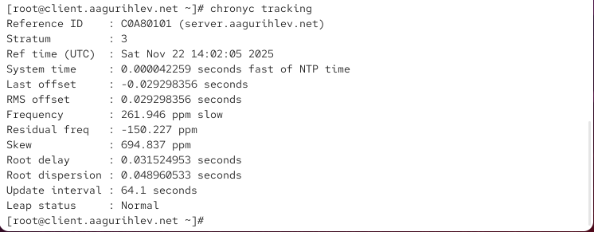{#fig-021 height=80%}

tracking chrony сервера ([рис. @fig-022])

{#fig-022 height=80%}

Provision скрипт ntp для сервера ([рис. @fig-023])

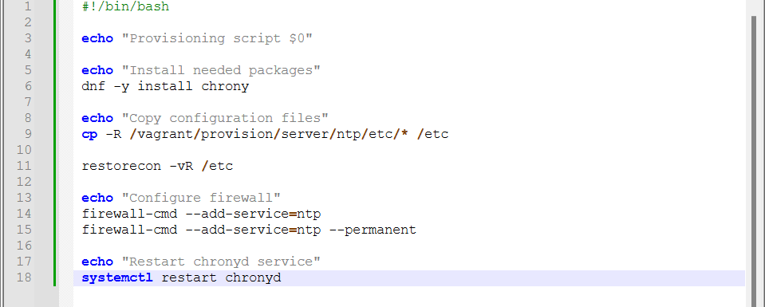{#fig-023 height=80%}

Внесение изменений в окружение Vagrant с клиента ([рис. @fig-024])

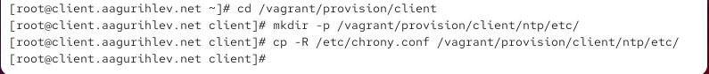{#fig-024 height=80%}

Provision скрипт ntp для клиента ([рис. @fig-025])

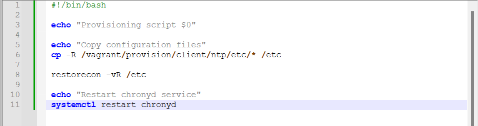{#fig-025 height=80%}

Конфигурация Vagrantfile сервера ([рис. @fig-026])

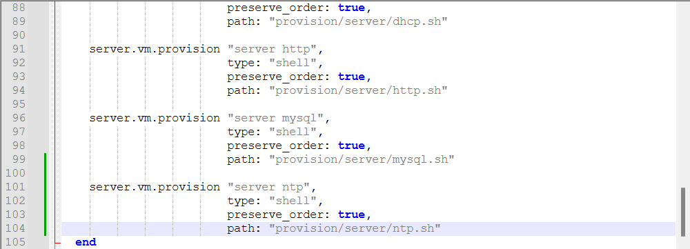{#fig-026 height=80%}

Конфигурация Vagrantfile клиента ([рис. @fig-027])

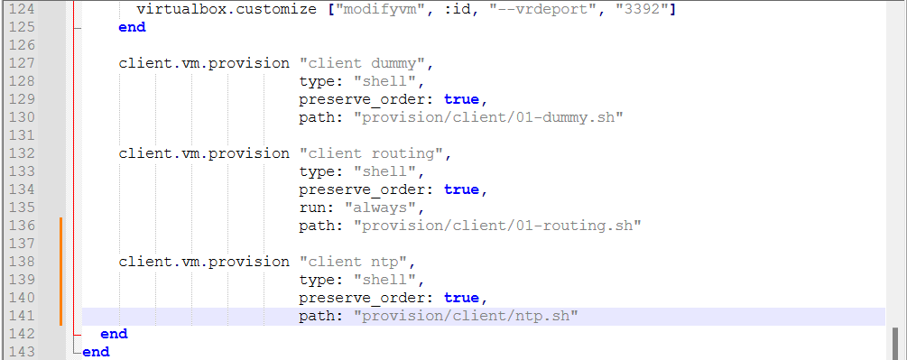{#fig-027 height=80%}

# Выводы

В этой лабораторной работе были получены навыки по управлению системным временем и настройке синхронизации времени.