---
## Author
author:
  name: Гурылев Артем Андреевич
  email: 1132236135@pfur.ru
  affiliation:
    - name: Российский университет дружбы народов
## Title
title: Лабораторная работа №13
subtitle: Настройка NFS
license: CC BY
date: today
date-format: "YYYY-MM-DD"
---

# Информация

## Докладчик

  * Гурылев Артем Андреевич
  * Студент
  * Российский университет дружбы народов им. П. Лумумбы

## Цель работы

- Целью данной лабораторной работы является приобретение навыков настройки сервера NFS для удалённого доступа к ресурсам.

# Выполнение лабораторной работы

## Установка nfs-utils

{height=80%}

## Файл exports

{height=80%}

## Настройка SELinux

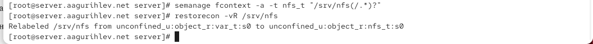{height=80%}

## Настройка межсетевого экрана и запуск сервера

{height=80%}

## Установка nfs-utils на клиент

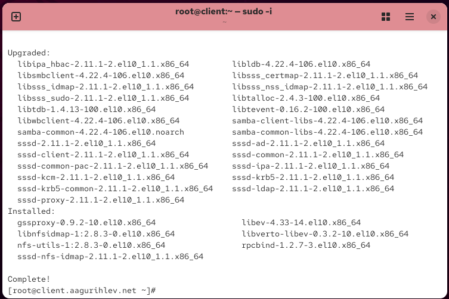{height=80%}

## showmount с включенным межсетевым экраном

{height=80%}

## showmount с выключенным сетевым экраном

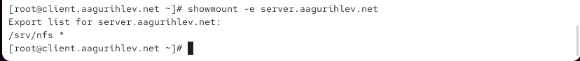{height=80%}

## Службы, связанные с nfs

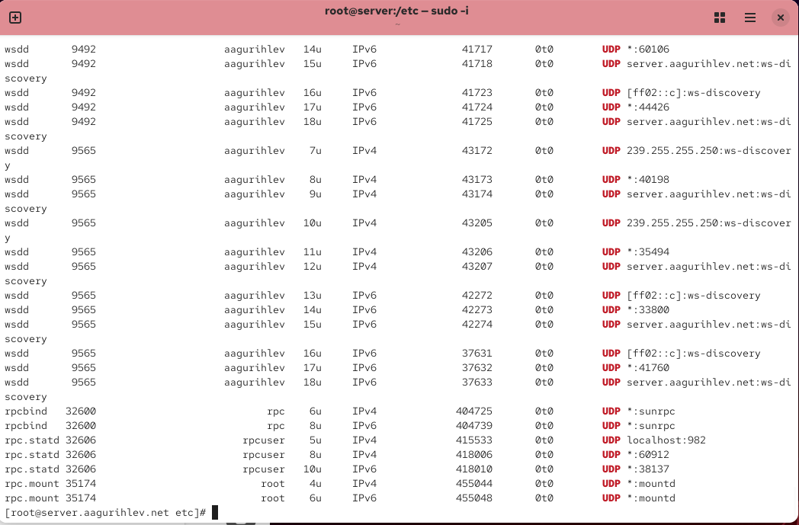{height=80%}

## Добавление нужных служб в межсетевой экран

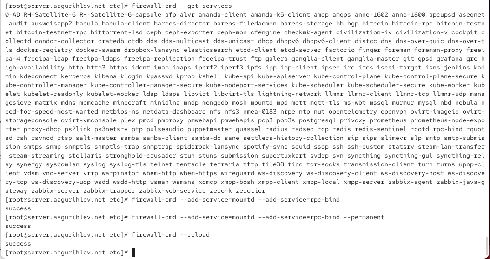{height=80%}

## Монтированная папка nfs на клиенте

{height=80%}

## Файл fstab на клиенте

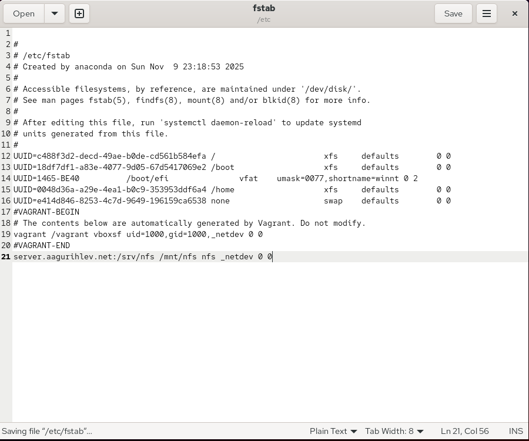{height=80%}

## Статус службы монтирования на клиенте

{height=80%}

## Монтированная папка после перезагрузки клиента

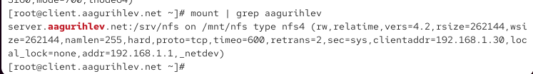{height=80%}

## Содержание папки nfs на сервере

{height=80%}

## Содержание папки nfs на клиенте

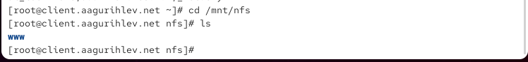{height=80%}

## Изменение файла exports

{height=80%}

## Файл fstab на сервере

{height=80%}

## Содержание каталога www в nfs папке клиента

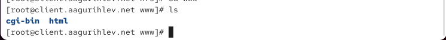{height=80%}

## Создание файла для пользовательского каталога

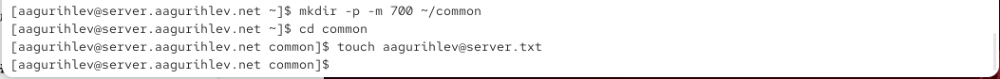{height=80%}

## Каталог пользователя и его права

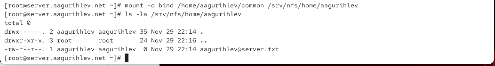{height=80%}

## Изменение файла exports

{height=80%}

## Изменение файла fstab

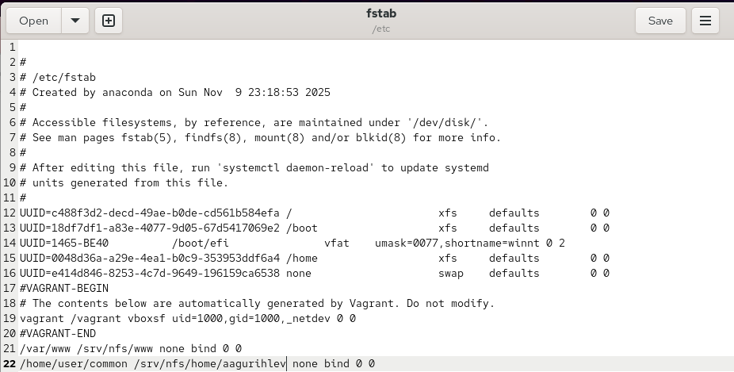{height=80%}

## Содержание nfs папки пользователя на клиенте

{height=80%}

## Содержание nfs папки пользователя на серве после добавления файла

{height=80%}

## Внесение изменений в окружение Vagrant

{height=80%}

## Provision скрипт nfs для сервера

{height=80%}

## Provision скрипт nfs для клиента

{height=80%}

## Конфигурация vagrantfile для сервера

{height=80%}

## Конфигурация vagrantfile для клиента

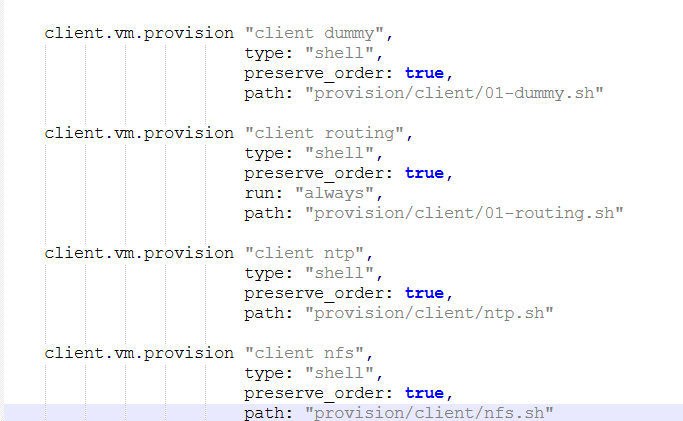{height=80%}

## Выводы

В этой лабораторной работе я приобрёл навыки настройки NFS, и создал общие каталоги между машинами server и client.