---
## Author
author:
  name: Гурылев Артем Андреевич
  email: 1132236135@pfur.ru
  affiliation:
    - name: Российский университет дружбы народов

## Title
title: "Лабораторная работа №13"
subtitle: "Настройка NFS"
license: "CC BY"
---

# Цель работы

Целью лабораторной работы является приобретение навыков настройки сервера NFS для удалённого доступа к ресурсам.

# Выполнение лабораторной работы

Установим на сервере необходимое программное обеспечение.([рис. @fig-001])

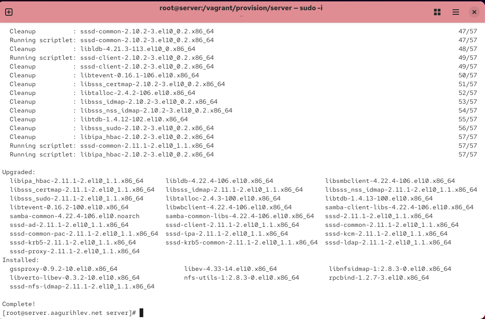{#fig-001}

Создадим каталог для работы с nfs, затем пропишем его в файле exports.([рис. @fig-002])

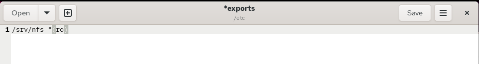{#fig-002}

Зададим контекст безопасности для SELinux.([рис. @fig-003])

{#fig-003}

Запустим сервер NFS и настроим межсетевой экран, включив его в службы.([рис. @fig-004])

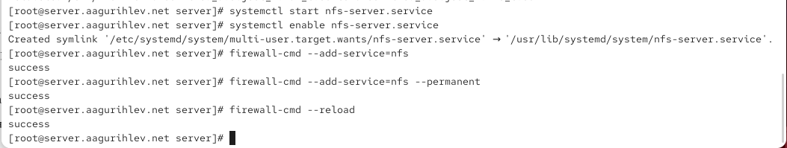{#fig-004}

Теперь установим на клиенте необходимое программное обеспечение.([рис. @fig-005])

{#fig-005}

Попробуем посмотреть имеющиеся подмонтированные удалённые ресурсы. Межсетевой экран не пропускает RPC соединение - программа не может получить с сервера файлы.([рис. @fig-006])

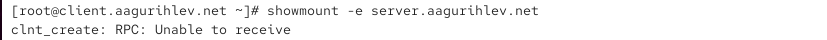{#fig-006}

Выключим межсетевой экран на сервере. Теперь NFS может получать данные с сервера, так как соединение не блокируется.([рис. @fig-007])

{#fig-007}

Чтобы межсетевой экран пропускал RPC соединение, нужно найти службы, с ним связанные.([рис. @fig-008])

{#fig-008}

Добавим эти две службы в межсетевой экран. Теперь на клиенте проходит соединение RPC и подключение удаленного ресурса.([рис. @fig-009])

{#fig-009}

Создадим каталог для подключения удаленных ресурсов на клиенте. Проверим, смонтировался ли он.([рис. @fig-010])

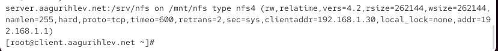{#fig-010}

Добавим в файл fstab нужную запись. В ней описываются настройки монтирования папки.([рис. @fig-011])

{#fig-011}

Проверим наличие службы автоматического монтирования - она присутствует в системе и работает.([рис. @fig-012])

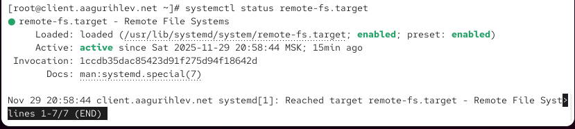{#fig-012}

После перезагрузки клиента наша папка автоматически подключается.([рис. @fig-013])

{#fig-013}

На сервере создадим общий каталог www и подмонтируем его к оригинальному каталогу www. Проверим содержание папки nfs.([рис. @fig-014])

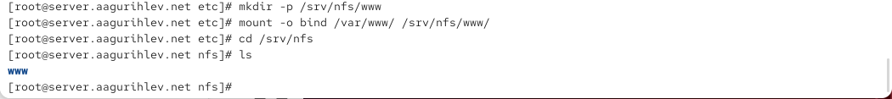{#fig-014}

На клиент передались наши изменения, и появилась папка www.([рис. @fig-015])

{#fig-015}

Изменим файл exports на сервере и пропишем в нём каталог www.([рис. @fig-016])

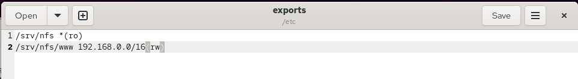{#fig-016}

После проверки содержимого на клиенте изменим файл fstab на сервере, добавив данные о каталоге www.([рис. @fig-017])

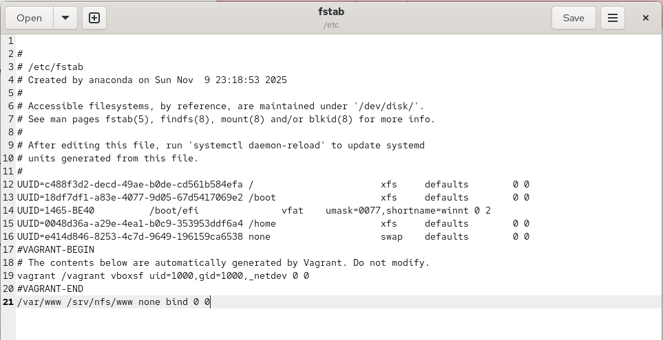{#fig-017}

Повторно экспортируем каталоги, и проверим содержимое на клиенте. Теперь у нас появились файлы и директории в каталоге www.([рис. @fig-018])

{#fig-018}

На сервере создадим пользовательский каталог и файл в нём с определёнными правами доступа.([рис. @fig-019])

{#fig-019}

Подмонтируем этот каталог в новый каталог в папке nfs. Его может изменять только наш пользователь - у остальных нет каких-либо прав доступа.([рис. @fig-020])

{#fig-020}

В файле exports подключим наш пользовательский каталог.([рис. @fig-021])

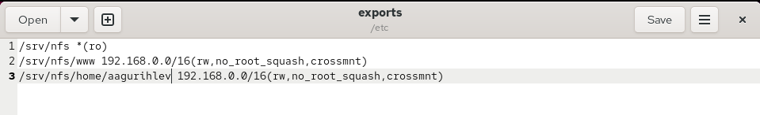{#fig-021}

В fstab внесём данные о монтировании пользовательского каталога.([рис. @fig-022])

{#fig-022}

Повторно экспортируем каталоги. На клиенте появился наш файл.([рис. @fig-023])

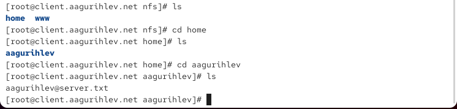{#fig-023}

На клиенте создадим пользовательский файл и внесём в него изменения, после чего проверим его наличие на сервере.([рис. @fig-024])

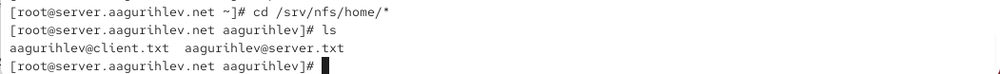{#fig-024}

Теперь внесём изменения в окружение Vagrant, добавив новые provision скрипты.([рис. @fig-025])

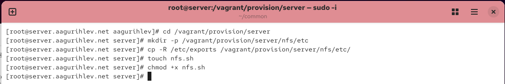{#fig-025}

Сделаем provision скрипт для сервера, чтобы производилась установка nfs.([рис. @fig-026])

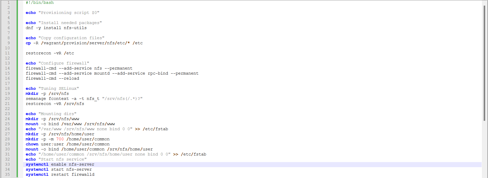{#fig-026}

Сделаем provision скрипт для клиента, чтобы производилась установка nfs.([рис. @fig-027])

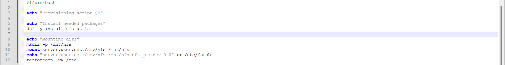{#fig-027}

В Vagrantfile для сервера добавим скрипт nfs.([рис. @fig-028])

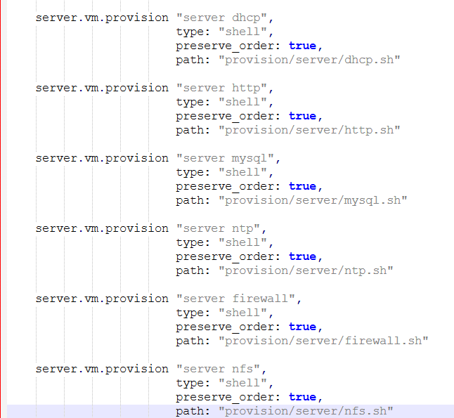{#fig-028}

В Vagrantfile для клиента добавим скрипт nfs.([рис. @fig-029])

{#fig-029}

# Выводы

В этой лабораторной работе я приобрёл навыки настройки NFS, и создал общие каталоги между машинами server и client.