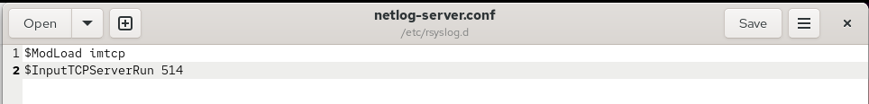
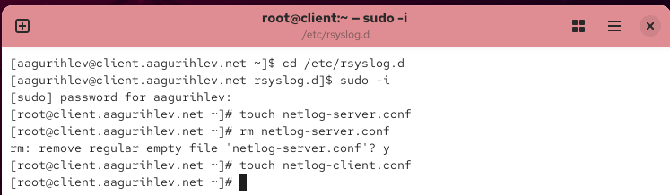
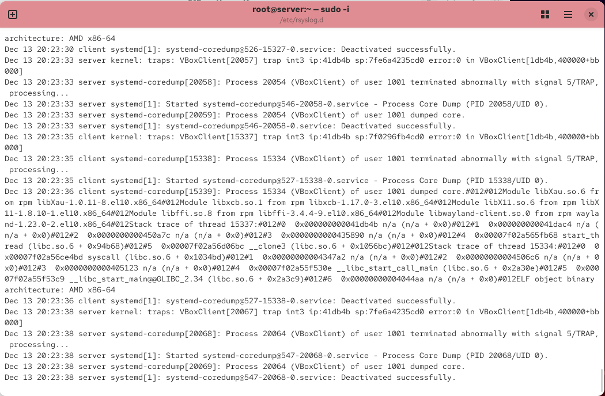
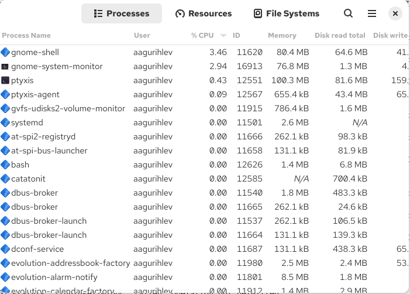
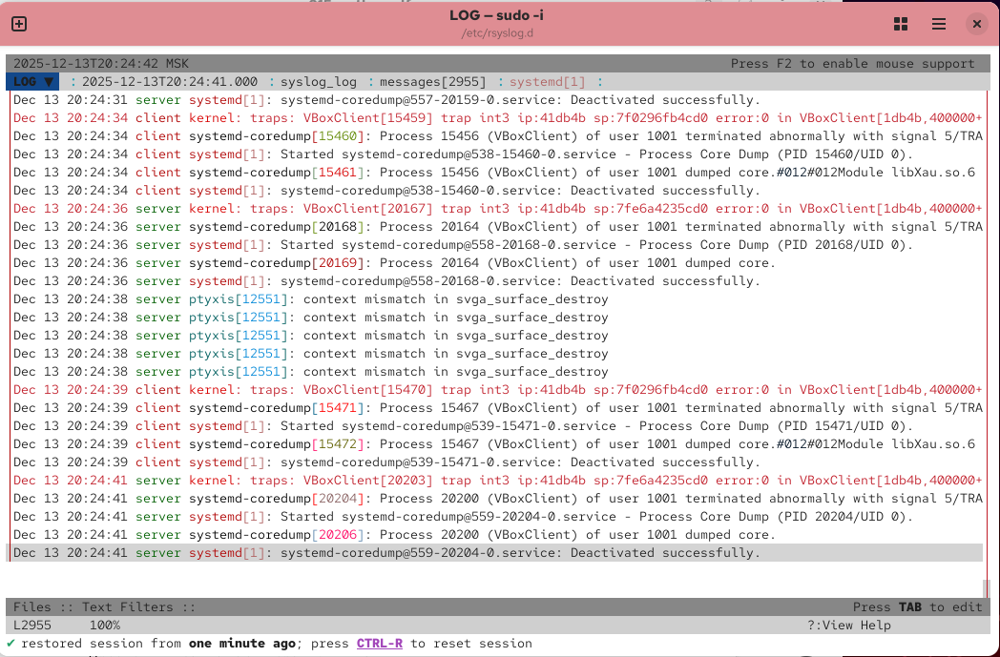
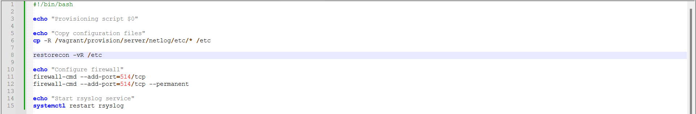
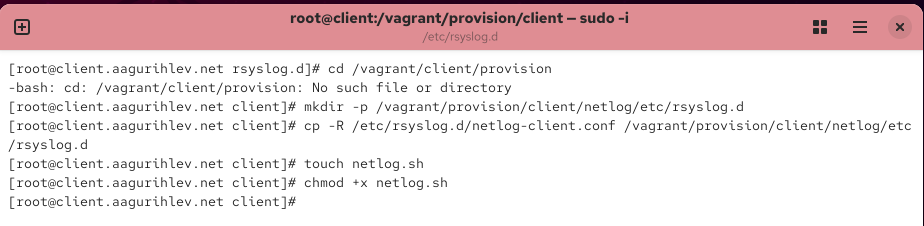
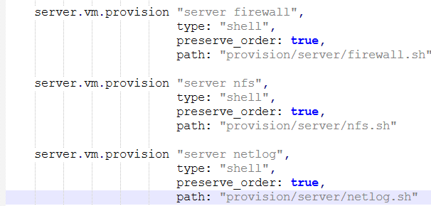
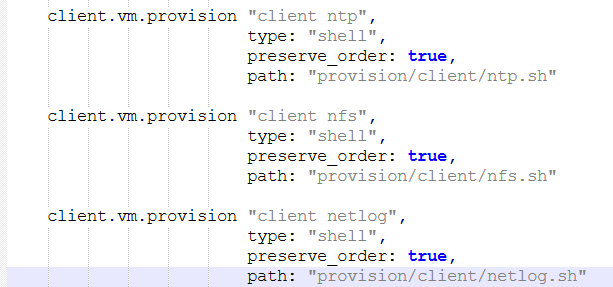

---
## Author
author:
  name: Гурылев Артем Андреевич
  email: 1132236135@pfur.ru
  affiliation:
    - name: Российский университет дружбы народов
## Title
title: Лабораторная работа №15
subtitle: Настройка сетевого журналирования
license: CC BY
date: today
date-format: "YYYY-MM-DD"
---

# Информация

## Докладчик

  * Гурылев Артем Андреевич
  * Студент
  * Российский университет дружбы народов им. П. Лумумбы

## Цель работы

- Целью данной лабораторной работы является получение навыков по работе с журналами системных событий.

# Выполнение лабораторной работы

## Создание конфигурационного файла netlog-server.conf

{height=80%}

## Содержание конфигурационного файла

{height=80%}

## Прослушиваемые rsyslog TCP порты

{height=80%}

## Конфигурирование межсетевого экрана

{height=80%}

## Создание конфигурационного файла netlog-client.conf

{height=80%}

## Содержание конфигурационного файла

{height=80%}

## Содержание системных логов

{height=80%}

## Оболочка GNOME System Monitor

{height=80%}

## Просмотр системных сообщений с помощью lnav

{height=80%}

## Изменение внутреннего окружения Vagrant для server

{height=80%}

## Provision файл для сервера netlog.sh

{height=80%}

## Изменение внутреннего окружения Vagrant для client

{height=80%}

## Provision файл для клиента netlog.sh

{height=80%}

## Добавление provision файла для сервера в Vagrantfile

{height=80%}

## Добавление provision файла для клиента в Vagrantfile

{height=80%}

## Выводы

В этой лабораторной работе я настроил перенаправление журналов системных событий с клиента на сервер, а также рассмотрел системные сообщения с обоих виртуальных машин.

