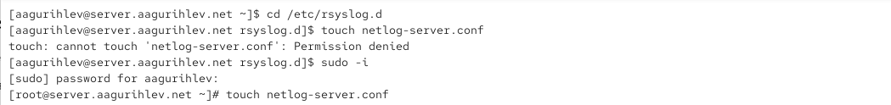
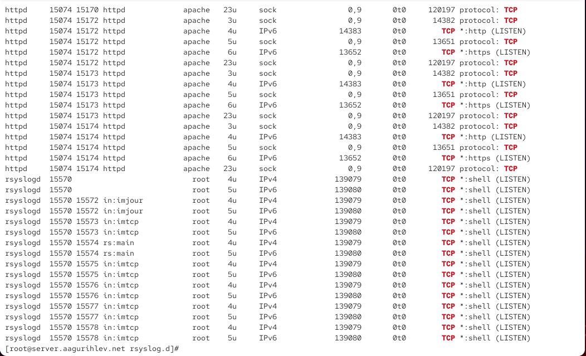
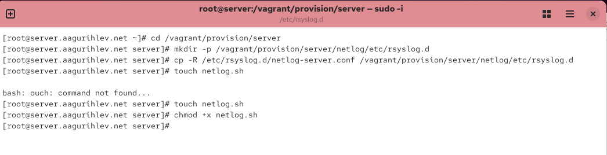
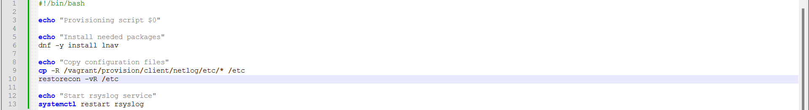

---
## Author
author:
  name: Гурылев Артем Андреевич
  email: 1132236135@pfur.ru
  affiliation:
    - name: Российский университет дружбы народов

## Title
title: "Лабораторная работа №15"
subtitle: "Настройка сетевого журналирования"
license: "CC BY"
---

# Цель работы

Целью лабораторной работы является получение навыков по работе с журналами системных событий.

# Выполнение лабораторной работы

Создадим файл конфигурации сетевого храненения журналов на сервере.([рис. @fig-001])

{#fig-001}

Включим в нем прием записей журнала по TCP порту 514.([рис. @fig-002])

{#fig-002}

После перезапуска посмотрим, какие порты прослушиваются службой rsyslog.([рис. @fig-003])

{#fig-003}

Теперь настроим межсетевой экран, добавив него нужный TCP порт 514.([рис. @fig-004])

{#fig-004}

Перейдём к клиенту и создадим на нём файл конфигурации сетевого хранения журналов.([рис. @fig-005])

{#fig-005}

В нем мы включим перенаправление сообщений журнала на 514 TCP порт сервера, и затем перезапустим службу rsyslog. Теперь системные сообщения клиента отправляются на сервер.([рис. @fig-006])

{#fig-006}

Как мы можем увидеть, в системных сообщениях сервера стали появляться сообщения с клиента. К сожалению, исправить ошибки в этих журналах не представляется возможным, поскольку они возникают из-за бага в Virtualbox и Vagrant, и не привязаны к конкретной службе.([рис. @fig-007])

{#fig-007}

Теперь запустим оболочку GNOME System Monitor на основном пользователе. Мы можем увидеть разные процессы, и сколько ресурсов они занимают.([рис. @fig-008])

{#fig-008}

Теперь посмотрим системные сообщения с помощью lnav. С помощью этой команды удобнее просматривать эти журналы.([рис. @fig-009])

{#fig-009}

Создадим нужные каталоги для provision скриптов сервера.([рис. @fig-010])

{#fig-010}

Создадим скрипт netlog.sh для сервера.([рис. @fig-011])

{#fig-011}

Создадим нужные каталоги для provision скриптов клиента.([рис. @fig-012])

{#fig-012}

Теперь создадим proviosion скрипт netlog.sh для клиента.([рис. @fig-013])

{#fig-013}

Настроим Vagrantfile - добавим в конфигурацию provision файл для сервера.([рис. @fig-014])

{#fig-014}

Также добавим provision скрипт для клиента.([рис. @fig-015])

{#fig-015}

# Выводы

В этой лабораторной работе я настроил перенаправление журналов системных событий с клиента на сервер, а также рассмотрел системные сообщения с обоих виртуальных машин.